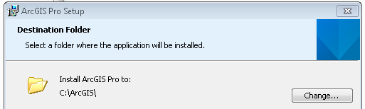

##ArcGIS XI DotNet API Documentation Guide
The guide is split into three parts:
* A Quick Reference Guide
* Setting up for check in/out of Star Team
* A Quick Reference Guide
* A more detailed API Documentation Reference documentation generation process
* An Appendix containing a code comment formatting reference:

There are also numerous examples of code comments in this guide. Additionally, there is an example csproj illustrating different examples of code comment formatting and structuring that can be downloaded from the <a href=" https://devtopia.esri.com/ArcGISPro-SDK/win-net-documentation">Pro App SDK github repository</a> . You will need to login to devtopia first.

##Purpose of This Guide
The purpose of this guide is to provide you, the author, with step by step instructions on how to document the Reference API using csharp code comments. Any publicly scoped type (to include protected base classes) and corresponding public and protected members in the ArcGIS Professional Managed Assemblies must be documented. The DotNet Reference API is one of the primary extensibility points for ArcGIS Professional available to 3rd party developers (the other extensibility points currently being Arcpy.Mapping via Python and Geoprocessing tools and toolboxes). 

##Prerequisites

You will need the following software installed to author Reference API content:
* Either Visual Studio 2012 and Visual Studio Update 4 (or the latest update if it has since rev’d since this document was written). Note: the version of Visual Studio should always exactly match the version of the solution (.sln) files used for the __ArcGIS Professional code base__ (not the version used for the SDK or samples). This version will change over time.
* [Visual Studio Spell Checker extension](http://visualstudiogallery.msdn.microsoft.com/7c8341f1-ebac-40c8-92c2-476db8d523ce)
* <a href = "\\esri.com\Software\Desktop\DesktopA-L\Innovasys\DocumentX\2013">Document! X for Innovasys.</a>. This requires a license. You must request this software through your Manager
* [Star Team – the install document](http://devinfo/sites/DeveloperCentral/Shared%20Documents/Forms/AllItems.aspx?RootFolder=%2fsites%2fDeveloperCentral%2fShared%20Documents%2fStarTeam%20Documents&View=%7b4652831D%2d65B5%2d47FC%2d9D7D%2d4388EC6DFC2A%7d)

Additionally, you may choose to download the [CSharp code comment examples](https://devtopia.esri.com/ArcGISPro-SDK/win-net-documentation) on devtopia. It is a Visual Studio solution containing various csharp source files each illustrating different formatting and structuring techniques for code comments.

##Setting up for check in/out of Star Team
In order to successfully update Triple Slash “\\\” changes to source code, PE’s need to understand a few things about the development process like:
* Installing and then updating ArcGIS Pro using GetBuild batch files,
* Pulling source code from StarTeam and checking it back in,
* Keeping source code synchronized with Pro build numbers.
Note to Product Engineers: 
* Triple Slash “\\\” documentation requires that you read and write source code files from StarTeam.  This means that you need the appropriate StarTeam permissions.  
* It is recommended that you have direct access to a machine in Redlands (it can be via remote desktop) because you will be running GetBuild  batch scripts that update your ArcGIS Pro build with current files.  If you are updating a remote machine, it could take a very long time.
* It is also recommended that you uninstall ArcMap from the machine that is being used to update “\\\” doc.  It may not affect the “\\\” process but it does have some negative affect on the registry for some developers.
The following steps assume you do NOT have ArcGIS Pro installed on your machine and there is NOT a folder called **C:\ArcGIS already on your local machine**.

###Install ArcGIS Pro

You will only install Pro manually from a .MSI file once.  All subsequent updates will be done using GetBuildRelease batch scripts.  

**Step 1**: Determine the most current build by opening the following file:  
	[\\archive\11Builds_64\ReleaseOK.txt](\\archive\11Builds_64\ReleaseOK.txt)  - note the build number.

**Step 2**: Based on the step above, install Pro from the appropriate folder in:  
	[\\archive\11NonDevSetups\XXXX\ArcGISPro](\\archive\11NonDevSetups\XXXX\ArcGISPro)  
	Be sure to install into the C:\ArcGIS folder (NOT the default Program Files folder)





###Run GetBuildRelease.bat


The GetBuildRelease batch file will run a process that will replace many of the release DLLs with build DLLs as well as install many additional support files.  These files make it possible to compile your updated source code files.  
First, you need to download the batch files from Star Team onto your local drive.  

**Step 1**: Open Star Team to the ArcGIS11-Gold view.  

Next you will build a folder structure on your local drive (within C:\ArcGIS) to store Star Team GetBuild batch files.  

**Step 2**:  Find the ArcGIS\SharedArcGIS folder in StarTeam. Right-click the **SharedArcGIS** folder and select “Create Working Folders”.  


**Step 3**: In Star Team, make sure the file tab is active, then highlight the SharedArcGIS folder (in the TOC), then click the All Descendants button to display the StarTeam files. Your screen should look similar to the graphic below.  

There are over 16K file that will be downloaded.  Many of the files in this shared folder are needed so you can complile your modified solutions.  There is also an SDK subfolder that will provide examples and code snippets.  

**Step 4**: Right-click Status: Missing (xxx items) and select **Check Out All …,** select Current revision and click OK.  

This can take a while but it is a one time check-out.  

**Step 5**: In file explorer, browse to C:\ArcGIS\SharedArcGIS\Build\GetBuildScripts.  Double-click the GetBuildRelease.bat.  

**Step 6**: When finished, you will be prompted to press enter to close the CMD.


**IMPORTANT NOTE (Running GetBuild for a specific build):**  

This may not happen often, but sometimes you don't want to move to the currently available build of Pro (because there could be known issues with it, you may want to roll back to another build for testing, etc).  For these cases, there is a file you can edit that allows you to control exactly which build of the software gets installed locally when you run GetBuildRelease.bat.  

To do this – Open the C:\ArcGIS\SharedArcGIS\Build\GetBuildScripts\GetBuildScript.ps1 file in NotePad and modify the second line to include the build number between the two double quotes.  

If there is no value between the quotes (just two double quotes), then the current release is installed when GetBuildRelease is executed.  

###Check out source code and other support files


Similar to the steps above, you are going to create additional Working folders.  But this time, before checking out the files, you will make sure that the source code files are synchronized (i.e., same build) with the build of ArcGIS Pro you currently have installed.  

**Step 1**: If necessary, open Star Team to the ArcGIS11-Gold view.  

**Step 2**: **Go to View--> Select Configuration…** then check the Labeled configuration / build number that matches your ArcGIS Pro install build number.  In the example below, the local install is for build 2971.  

The status bar in the lower left-hand corner should update with the appropriate label.  
	 
**Step 3**: Create a working folders for:  

ArcGIS\ArcGISDesktop\ServiceContracts – everyone needs this  

ArcGIS\ArcGISDesktop\ArcGISXXXX *  -  team specific folder(s)  

Create a working folder for your respective ArcGIS\ArcGISDesktop\ArcGISXXXX content (e.g. ArcGISLayout, ArcGISMapping, ArcGISCatalog, etc.), depending on which sub-folder pertains to your content.  

**Step 4**: Again, for each folder above make sure the file tab is active, then highlight that folder (in the TOC), then click the All Descendants button to display the StarTeam files. Finally right-click Status: Missing (xxx items) and select Check Out All and click OK.  

**Note**: you don’t need to set the label since you’ve already configured it in Star Team.  I.e., the Current revision will use the label you set.  Setting the label (to the same one) won’t hurt either.  


##Quick Reference Guide
 
**Step 1**: Run GetBuildRelease.bat from C:\ArcGIS\SharedArcGIS\Build\GetBuildScripts  

[\\archive\11Builds_64\ReleaseOK.txt](\\archive\11Builds_64\ReleaseOK.txt)  - note the build number.  

See notes above to run a GetBuild on a specific build number.  

**Step 2**: Set your Star Team label to match the ArcGIS Pro build number from above.  

Go to View --> Select Configuration.  

**Step 3**: Check out all “Missing” and “Out Of Date” files for all appropriate folders.  Be sure to check the All Descendants button first.  Use “Check Out…” on the Status: Missing (xxx items) or Status: Out of Date (xx items) groups.

Basic rules:  

* Be cautious to check out “modified” files from a labeled configuration because you may undo your changes.  
* Never check out “out of date” files from the “current” configuration because the files may not have been compiled.  
* Anything that is marked “Not in View” is something that got removed. You will need to manually remove that file from your local folder structure.  

To avoid these conflicts, it is best not to increment GetBuild by just a single build after changes were installed.  You want to make sure your changes have been installed into the source code.

**Step 4**: Click **F5** to refresh each folder to make sure files are not missing or out of date.  

**Step 5**: In File Explorer, double-click the solution file in the sub-folder you checked out. For example: ArcGISLayout.sln.  

 
**Step 6**: If you open the solution, make sure the solutions configuration is set to Release.  
	 
**Step 7**: Open the Configuration Manager (from the pull-down arrow next to Release in the graphic above) and make sure you 1) set the Active solution platform = x64 and 2) you are only building the solution for the managed code, not the native code.  In the example below, there is only a checked checkbox for ArcGISDesktop.Layouts.

 
Rule – you will make changes to the solution, but never check it into StarTeam, only check in .cs files.

**Step 8**: __KNOW WHAT *.CS FILES TO EDIT!__  Talk to your developer. For the Layout team, these files are located under API\Models:

	 
**Step 9**: Edit your “\\\” documentation.  __Suggested workflow__ - the Layout team API developer, stubs out the Triple Slash comments in all the appropriate places.  This process makes it much easier for the PE to know exactly where they need to insert their documentation.

	 
**Step 10**: Correct typos and spelling using the Visual Studio spell checker extension.

**Step 11**: Optionally, use the “Edit Documentation” Document! X Visual Studio extension to preview how your documentation will look on the output.

**Step 12**: Save your solution.

**Step 13**: Build your solution and verify there are no errors and close.

**Step 14**: Reset your Label back to __Current Configuration__.  Go to View --> Select Configuration.  You must be in the current view to create CRs and check in changes.  You always check into the current release.

**Step 15**: All source code changes must be associated with a CR.  __Create a CR__ for the Doc change (or use an existing CR). If it is a blanket CR for Doc changes that is fine. Assign yourself to the CR. 

**Step 16**: Compare contents.  Right-click your modified item and select __Compare Contents__.  This allows your to verify the changes made.  If things don’t look right, work with your developer.  In the graphic below, you see the original on the left and the modified file on the right.  In this example, the Dev only stubbed out the ///summary, not the remarks.  The revised version made the correction and added “///” doc.

 

**Step 17**: If the contents are OK, right-click on your modified items and select __Check In__
 
Again, only check in .cs files.

**Step 18**:  Associate CR with Check In and add comments.
	 
**Step 19**: Hope you did not break the build!!!

**Step 20**: Begin documenting your code comments. You must comment all public and protected types in the managed code only. You must comment all public and protected members on public and protected types (to include statics) with the following exception: protected members on public sealed classes should be __excluded__ from the API documentation. Refer to the section __Excluding types and members from the API Reference__ for more information.

You do NOT need to comment any internal classes or methods. For details on how to format and structure comments consult the Appendix and Reference sections of this document.


###For Classes, Structs, and Delegates :

Add a summary and remarks xml code comment element. The summary is a single line. The remarks can be multiple lines using <para></para> tags for additional structuring of content. Begin the summary sentence with a verb. 

For example: “Opens the, Creates the, Returns the, Responds to, Represents a, Provides access to, etc.”

```c#
/// <summary>
/// Represents a spatial bookmark which identifies a specific geographic location in 
/// the map
/// </summary>
/// <remarks>
/// <para>Bookmarks can be spatial (2D or 3D) or temporal. If your map is time-enabled, 
/// bookmarks can be created for a specific point in time. Bookmarks in an ArcGIS
/// Pro project are associated and managed with the map they were created. Bookmarks 
/// are transferable, so you can re-use bookmarks between multiple maps and scenes
/// in your project, as well as with or without temporal information.</para>
/// <para>The map's collection of bookmarks can be returned using the 
/// <b>GetMapBoomarks</b> method on the 
/// <see cref="ArcGIS.Desktop.Mapping.BookmarksManager" /> class.
/// <see cref="ArcGIS.Desktop.Mapping.BookmarksManager"/> also provides several static 
/// methods that take a Bookmark as a parameter to either set the location of the map 
/// or manage the bookmarks for the map. For example <b>ZoomToBookmarkAsync</b> can be 
/// used to zoom the active map to the location of the bookmark.</para>
/// </remarks>
public sealed class Bookmark : PropertyChangedBase {

```

Note: For __sentence descriptions__ in the <summary></summary> or <remarks></remarks> of any entity or member refer to the **Documentation Team Guide**

###For Interfaces:

Begin the summary for an Interface like this: Provides a mechanism for <insert-interface-description-here>

```c#
/// <summary>
/// Provides a mechanism for ....
/// </summary>
public interface IDisplayTable
{
```

* It is not required to mention the Interface in the summary tag of the class that implements it.
* All classes that implement the interface need triple slash comments.

###For Enums:

Add a summary. Begin the summary with the phrase __"Specifies…”__

```c#
   /// <summary>
  /// Specifies the method used to store geographic location with the bookmark
  /// </summary>
  public enum BookmarkType {
```

Now, add comments to all __public and protected members__ of all public types.

###For Fields:

Fields should __not__ be in the public API with the exception of public const (i.e. constants). Document constants with a summary.

###For Properties:

Add a summary. If the Property is a __“getter”__, start the summary with the phrase “Gets the…” or “Gets if the…”. If the Property is a __“setter”__, start the summary with the phrase “Sets the…” or “Sets if the…”. If the Property is both a __“getter”__ and __“setter”__, start the summary with the phrase “Gets or sets the…” or “Gets and sets if the…”.

```c#
/// <summary>
/// Gets the name of the bookmark
/// </summary>
public string Name
    {
      get { return _name; }
      internal set { SetProperty(ref _name, value, () => Name); }
    }
```

Use the <value> tag to create a “Property Value” section underneath your property “signature” on the output topic page.  

```c#
/// <summary>
/// Retrieves an int.
/// </summary>
/// <value>
/// Type: <see cref="System.Int32" /> 
/// The stream length in bytes.
/// </value>
        public int myLength
        {
            get
            {
                return 2;
            }
        }
```


###For Events:

Add a summary. Begin the summary with the phrase “Occurs when…”. 

If an event is a CompositePresentationEvent, add a summary that begins with “Occurs when…” and document the event class methods using the guidance for Methods and Constructors.

```c#
/// <summary>
/// Occurs when a Foo operation has completed
/// </summary>
  public sealed class FooEvent : CompositePresentationEvent<FooEventArgs>  {
    /// <summary>
    /// Subscribe to the FooEvent.
    /// </summary>
///<returns><see cref=”ArcGIS.Core.Events.SubscriptionToken”/></returns>
    public static SubscriptionToken Subscribe(…) {}

    /// <summary>
    /// Unsubscribe from the FooEvent
    /// </summary>
    public static void Unsubscribe(…) { }

    /// <exclude></exclude>
    protected override void OnSubscribe(…) { }

/// <exclude></exclude>
   protected override void OnUnsubscribe(…) { }
  }
```

Note that the OnSubscribe and OnUnsubscribe methods are protected within a __public sealed__ class and so are __excluded__ from the public API reference with an “<exclude></exclude>” comment. Refer to the section __Excluding Types and Members from the API Reference__ section for details.

###For Methods and Constructors:

Add a summary. Begin the summary with a verb. For example: Opens the, Creates the, Returns the, Responds to, Represents a, Provides access to, etc. Add a remarks as necessary (at the author’s discretion). Document all parameters and the return value. Document all exceptions that can be thrown by the method using an <exception></exception> tag for each. Add a remarks as necessary (at the author’s discretion). 

```c#
/// <summary>
/// Creates a new bookmark using the current location and time of the map view. This
/// method must be called on the MCT. Use QueuedTask.Run
/// </summary>
/// <param name="mapView">The map view used to create the bookmark</param>
/// <param name="name">The name of the new bookmark</param>
/// <returns>The new bookmark added to the map</returns>
/// <exception cref="System.ArgumentException">The MapView must contain this Map and the name of the Bookmark must be unique for the Map</exception>
/// <exception cref="System.ArgumentNullException">The MapView cannot be null</exception>
/// <exception cref="ArcGIS.Core.CalledOnWrongThreadException">This method or property must be called within the lambda passed to QueuedTask.Run</exception>
	public Bookmark AddBookmark(MapView mapView, string name)
```

Corresponding help as seen through the Intellisense in Visual Studio:

 

####For Methods with parameters:

To specify parameters that are types in Pro, please use “cref”. Examples:

```c#
/// <summary>
/// Zooms to the bookmark
/// </summary>
/// <param name="bmk"><see cref="ArcGIS.Desktop.Mapping.Bookmark"/></param>
/// <returns><see cref="ArcGIS.Desktop.Mapping.Bookmark"/></returns>
	public Bookmark ZoomToBookmark(Bookmark bmk)
	{
```

####For Methods with Optional\default parameters

To specify the default values for optional parameters in a method, use the following format:
```c#
/// <param name="checkXYZSetting">(optional) Description goes here. (default value = false)</param>
```
####Synchronous API Methods that must be called on a specific thread.

It is common in the API for synchronous methods to throw an exception if they are called from the wrong thread. Thread affinity should be explicitly documented in the <summary></summary> section of the method header as follows:

	1. If a method needs to be called on the MCT (Main CIM Thread) add the following text to the summary “This method must be called on the MCT. Use QueuedTask.Run”:

``` c#
/// <summary>
/// Creates a new bookmark using the current location and time of the map view. This
/// method must be called on the MCT. Use QueuedTask.Run
/// </summary>
```

	2. If a method needs to be called on the UI Thread add the following text to the summary “This method must be called on the UI thread.”:

```c#
/// <summary>
/// Creates a new bookmark using the current location and time of the map view. This 
/// method must be called on the UI thread.
/// </summary>
```

	3.If a method can be run on any thread, no additional text is required.

Be sure to add the <exception></exception> tags for the exceptions resulting from calling a synchronous method from the wrong thread.

####For return types:

If your method returns a type that is documented in the ArcGIS Pro API Guide (one of the Pro types such as a “Bookmark”), you have to create a “cref” for that object. This allows direct linking to that type.  If your method returns a string, an int or double, it is optional to create a “cref” to link it to msdn.

A few examples:

```c#
/// <returns><see cref="ArcGIS.Desktop.Layouts.Models.Element.CIMEelement"/></returns>
public CIMElement GetCIMElement()
…

/// <returns><see cref="ArcGIS.Desktop.Mapping.Bookmark"/></returns>
public Bookmark GetMyBookmark()
…

Optional:
/// <returns><see cref="System.String"/></returns>
public string MakeString()
…


/// <returns><see cref="System.Int32"/></returns>
public int GetInt32()
…
```

####For return types of Task or Task <T>:

Per MSDN

If your method returns Task use this return statement pattern: A Task that represents <MethodName>

```c#
/// <returns>
/// A Task that represents <see cref="ArcGIS.Desktop.Mapping.MoveBookmark"/>.
/// </returns>
public Task MoveBookmark(Bookmark bookmark, int newIndex)
```

If your method returns Task<T> use this return statement pattern: A Task returning a <Describe T Here>. 

```c#
/// <returns>
/// A Task returning a collection of ><see cref="ArcGIS.Desktop.Mapping.Bookmark"/>.
/// </returns>

public Task<ReadOnlyObservableCollection<Bookmark>> QueryBookmarks()
```

Note: For generic return types that use <> (“less than – greater than angle brackets”) consider using {} (“curly brackets”) instead. For example: Instead of

```c#
/// <returns>Task<IEnumerable<Geometry>></returns>
```
Alternatively, consider using {} for angle brackets. For example Task<IEnumerable<Geometry>> could be Task{IEnumerable{Geometry}} (instead of Task&lt;IEnumerable&lt;Geometry&gt;&gt;)

```c#
 /// <returns>Task{IEnumerable{Geometry}}</returns>
```

###For Protected Methods

A protected member of a base class is accessible in a derived class only if the access occurs through the derived class type.  Follow these two simple rules to determine when to document a protected member and when to exclude it (because it cannot be accessed).

**Scenario 1:**

You have protected methods in a class marked PUBLIC:   DOCUMENT THE METHODS

```c#
/// <summary>
/// Protected methods should be documented in this class
/// </summary>
public class APIBaseClass {
///<summary>Document this method</summary>
protected void ProtectedMethod() {
```

**Scenario 2:**

You have protected methods in a class marked PUBLIC SEALED: EXCLUDE THE METHODS

```c#
/// <summary>
/// Protected methods should be excluded in this class
/// </summary>
public sealed class APIBaseClass {
  /// <exclude></exclude>
   protected void ProtectedMethod() {
```

DocumentX will __not make this distinction for you__

###For value within an Enum

Add a summary. Describe the purpose of the value.

Save your changes.

**Step 7**: Correct typos and spelling using the Visual Studio spell checker extension. Spelling mistakes will be underlined.                                  Hover over the typo to show the spell check assistant. Click on the assistant to show options.

 
You can also run the spell checker from the Visual Studio Tools menu.

 
Use the “Edit Documentation” Document! X Visual Studio extension to preview how your documentation will look on the output. Select the source file in the Solution Explorer, right click and select “Edit Documentation” from the context menu. A Documentation view of the source file will open in the Visual Studio. __You can also use the Edit Documentation view to add and update comment content__ if you prefer the WYSIWYG style of editing.

Opens the Document! X documentation view in Visual Studio.
 
**Step 8**: Build the .csproj. Ensure it builds correctly. Note: XML Comment warnings are currently suppressed.

**Step 9**: Create (or Open existing) a CR for the Doc change. If it is a blanket CR for Doc changes that is fine. Assign yourself to the CR. Check in you code comment changes.

**Step 10**: Recommended: Assign another member of your team to the CR and ask them to perform a Doc review. Assign the CR to them as fixed, they can mark it as Verified Fixed if the changes look good otherwise, they can send the CR back to the SDK Lead to incorporate changes, install and repeat.

Note: Copy edit and content review will be performed by the web documentation team (under Eleanor Haire) prior to documentation release.

###For Assembly and Namespace description

In the API Reference guide generated, every Assembly has an Overview page where you can describe the Assembly and all the namespaces in it.  These descriptions cannot be made using triple slash comments in the source code. Follow the steps below to add Assembly and Namespace description to your assembly.

 
####Assembly Description 

Currently, no Assembly description is needed.

####Namespace Description

**Step 1**: In the ArcGIS11-Gold view of StarTeam, browse to SharedArcGIS\SDK\NamespaceDescription folder.  In this location, there are folders that match each assembly name. Browse into the folder of your assembly.  For example:   SharedArcGIS\SDK\AssemblyDescription\ArcGIS.Desktop.Mapping.

**Step 2**: In your assembly folder, you will notice text files that correspond to each namespace in that assembly. Open these namespace text files and replace the TODO line with the namespace description. Use this format for describing the namespace:

```c#
The <namespace-goes-here> contains ……
The <namespace-goes-here> provides ……
The <namespace-goes-here> supports ……
```

For namespaces in your API that will become Internal (post Beta) please include the following namespace description in your namespace text file:

“This namespace contains classes and configuration types that are reserved for esri internal use only”

__Note:__ If you do not find your assembly’s folder or a specific namespace in your assembly, please create the folder for the assembly and\or the text file for the namespace in the assembly.

**Step 3**: Create a Change Request in the SharedArcGIS\SDK of starteam and assign it to a SDK team member – Uma Harano or Wolfgang Kaiser.

###Excluding Types and Members from the API Reference

There are instances of public or protected scoped classes or members that we want to exclude from the API Reference generation and/or suppress XML Documentation compiler warnings from the build.

To exclude a type and/or member from the generated API Reference or to suppress the XML compiler warnings use the following comment: ///<exclude></exclude>

####Shared Internals

“Internal” ArcGIS Pro managed code that is __scoped public__ (to enable access by other internal ESRI teams) __but__ is for internal ESRI use is referred to as “Shared Internals”. Shared Internal code is declared within an “Internal” namespace that follows the naming convention “ArcGIS.Desktop.Internal.XXXX”. 

Shared internals use a standard triple-slash class (or interface) header (refer to the __Appendix, Shared Internals__ section and the __Step by Step Guide, Step 6__, for more details). In the example below, the public and protected class members on the shared internal class have been tagged with an __“<exclude>”__ comment to suppress XML compiler warnings.

```c#
///<summary>This namespace contains classes and 
///configuration types that are <b>reserved</b> for esri internal use only
///</summary>
namespace ArcGIS.Desktop.Internal.NotSupportedNamespace {

    /// <summary>This class is not for public use and is used internally by the system to 
/// implement support for other esri modules
/// </summary>
    public class ExampleSharedInternalClassWithPublicScope {
        /// <exclude></exclude>
        public string Name { get; set; }
        /// <exclude></exclude>
        public string Description { get; set; }
        /// <exclude></exclude>
        public void DoFoo(string param1) {
            
        }

        private void DoFooPrivate() {
            //no need to "exclude" this - it is private
        }
    }
}
```

###Protected Members in a Public Sealed class

Normally, protected members MUST be triple-slashed. However, in the case of a protected method in a public class that has been marked as “sealed”, protected members must be excluded. They are not visible in the public API.

To determine if you are dealing with a protected member in a public sealed class check the following:

**Is the class declaration marked public AND sealed?**

```c#
public sealed class ExamplePublicSealedClass __Yes__
public class ExamplePublicClass __No__
```

If this is a public sealed class – use an exclude comment on the protected members

```c#
/// <summary>
    /// This class is <b><u>in</u></b> the public API
    /// </summary>
    public sealed class SpecificClass : BaseClass {

        /// <summary>
        /// This method is <b><u>in</u></b> the public API
        /// </summary>
        public void APublicMethodIntheAPI() {
            
        }
        /// <exclude></exclude>
        protected override void OverrideMe() {
            //This method should be excluded from the API Reference
            base.OverrideMe();
        }
        private void DoFooPrivate() {
            //no need to comment this - it is private
        } 
    }
```

If this is a public class but it is not sealed - the protected members are commented the same as public members.

```c#
/// This class is <b><u>in</u></b> the public API
    /// </summary>
    public class SpecificClass : BaseClass {

        /// <summary>
        /// This method is <b><u>in</u></b> the public API
        /// </summary>
        public void APublicMethodIntheAPI() {
            
        }
        /// <summary>
        /// This method is <b><u>in</u></b> the public API - the class is not sealed.
        /// you <b><u>must</u></b> provide a method description
        /// </summary>
        protected override void OverrideMe() {
            base.OverrideMe();
        }
        private void DoFooPrivate() {
            //no need to comment this - it is private
        } 
    }
```

Note: For details on how to suppress the XML compiler warnings for undocumented public and protected types without having to tag each occurrence with an “<exclude>” tag please refer to __Suppressing Compiler Warnings for XML Comments.__


