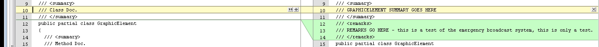

#ArcGIS XI DotNet API Documentation Guide
The guide is split into three parts:
* A Quick Reference Guide
* Setting up for check in/out of Star Team
* A Quick Reference Guide
* A more detailed API Documentation Reference documentation generation process
* An Appendix containing a code comment formatting reference:

There are also numerous examples of code comments in this guide. Additionally, there is an example csproj illustrating different examples of code comment formatting and structuring that can be downloaded from the <a href=" https://devtopia.esri.com/ArcGISPro-SDK/win-net-documentation">Pro App SDK github repository</a> . You will need to login to devtopia first.

##Purpose of This Guide
The purpose of this guide is to provide you, the author, with step by step instructions on how to document the Reference API using csharp code comments. Any publicly scoped type (to include protected base classes) and corresponding public and protected members in the ArcGIS Professional Managed Assemblies must be documented. The DotNet Reference API is one of the primary extensibility points for ArcGIS Professional available to 3rd party developers (the other extensibility points currently being Arcpy.Mapping via Python and Geoprocessing tools and toolboxes). 

##Prerequisites

You will need the following software installed to author Reference API content:
* Either Visual Studio 2012 and Visual Studio Update 4 (or the latest update if it has since rev’d since this document was written). Note: the version of Visual Studio should always exactly match the version of the solution (.sln) files used for the __ArcGIS Professional code base__ (not the version used for the SDK or samples). This version will change over time.
* [Visual Studio Spell Checker extension](http://visualstudiogallery.msdn.microsoft.com/7c8341f1-ebac-40c8-92c2-476db8d523ce)
* <a href = "\\esri.com\Software\Desktop\DesktopA-L\Innovasys\DocumentX\2013">Document! X for Innovasys.</a>. This requires a license. You must request this software through your Manager
* [Star Team – the install document](http://devinfo/sites/DeveloperCentral/Shared%20Documents/Forms/AllItems.aspx?RootFolder=%2fsites%2fDeveloperCentral%2fShared%20Documents%2fStarTeam%20Documents&View=%7b4652831D%2d65B5%2d47FC%2d9D7D%2d4388EC6DFC2A%7d)

Additionally, you may choose to download the [CSharp code comment examples](https://devtopia.esri.com/ArcGISPro-SDK/win-net-documentation) on devtopia. It is a Visual Studio solution containing various csharp source files each illustrating different formatting and structuring techniques for code comments.

##Setting up for check in/out of Star Team
In order to successfully update Triple Slash “\\\” changes to source code, PE’s need to understand a few things about the development process like:
* Installing and then updating ArcGIS Pro using GetBuild batch files,
* Pulling source code from StarTeam and checking it back in,
* Keeping source code synchronized with Pro build numbers.
Note to Product Engineers: 
* Triple Slash “\\\” documentation requires that you read and write source code files from StarTeam.  This means that you need the appropriate StarTeam permissions.  
* It is recommended that you have direct access to a machine in Redlands (it can be via remote desktop) because you will be running GetBuild  batch scripts that update your ArcGIS Pro build with current files.  If you are updating a remote machine, it could take a very long time.
* It is also recommended that you uninstall ArcMap from the machine that is being used to update “\\\” doc.  It may not affect the “\\\” process but it does have some negative affect on the registry for some developers.
The following steps assume you do NOT have ArcGIS Pro installed on your machine and there is NOT a folder called **C:\ArcGIS already on your local machine**.

###Install ArcGIS Pro

You will only install Pro manually from a .MSI file once.  All subsequent updates will be done using GetBuildRelease batch scripts.  

**Step 1**: Determine the most current build by opening the following file:  
	[\\archive\11Builds_64\ReleaseOK.txt](\\archive\11Builds_64\ReleaseOK.txt)  - note the build number.

**Step 2**: Based on the step above, install Pro from the appropriate folder in:  
	[\\archive\11NonDevSetups\XXXX\ArcGISPro](\\archive\11NonDevSetups\XXXX\ArcGISPro)  
	Be sure to install into the C:\ArcGIS folder (NOT the default Program Files folder)


###Run GetBuildRelease.bat


The GetBuildRelease batch file will run a process that will replace many of the release DLLs with build DLLs as well as install many additional support files.  These files make it possible to compile your updated source code files.  
First, you need to download the batch files from Star Team onto your local drive.  

**Step 1**: Open Star Team to the ArcGIS11-Gold view.  

Next you will build a folder structure on your local drive (within C:\ArcGIS) to store Star Team GetBuild batch files.  

**Step 2**:  Find the ArcGIS\SharedArcGIS folder in StarTeam. Right-click the **SharedArcGIS** folder and select “Create Working Folders”.  


**Step 3**: In Star Team, make sure the file tab is active, then highlight the SharedArcGIS folder (in the TOC), then click the All Descendants button to display the StarTeam files. Your screen should look similar to the graphic below. 

 

There are over 16K file that will be downloaded.  Many of the files in this shared folder are needed so you can complile your modified solutions.  There is also an SDK subfolder that will provide examples and code snippets.  

**Step 4**: Right-click Status: Missing (xxx items) and select **Check Out All …,** select Current revision and click OK.  

 

This can take a while but it is a one time check-out.  

**Step 5**: In file explorer, browse to C:\ArcGIS\SharedArcGIS\Build\GetBuildScripts.  Double-click the GetBuildRelease.bat.  

**Step 6**: When finished, you will be prompted to press enter to close the CMD.

 

**IMPORTANT NOTE (Running GetBuild for a specific build):**  

This may not happen often, but sometimes you don't want to move to the currently available build of Pro (because there could be known issues with it, you may want to roll back to another build for testing, etc).  For these cases, there is a file you can edit that allows you to control exactly which build of the software gets installed locally when you run GetBuildRelease.bat.  

To do this – Open the C:\ArcGIS\SharedArcGIS\Build\GetBuildScripts\__GetBuildScript.ps1__ file in NotePad and modify the second line to include the build number between the two double quotes.  


If there is no value between the quotes (just two double quotes), then the current release is installed when GetBuildRelease is executed.  

###Check out source code and other support files


Similar to the steps above, you are going to create additional Working folders.  But this time, before checking out the files, you will make sure that the source code files are synchronized (i.e., same build) with the build of ArcGIS Pro you currently have installed.  

**Step 1**: If necessary, open Star Team to the ArcGIS11-Gold view.  

**Step 2**: **Go to View--> Select Configuration…** then check the Labeled configuration / build number that matches your ArcGIS Pro install build number.  In the example below, the local install is for build 2971.  


The status bar in the lower left-hand corner should update with the appropriate label.  


	 
**Step 3**: Create a working folders for:  

ArcGIS\ArcGISDesktop\ServiceContracts – everyone needs this  

ArcGIS\ArcGISDesktop\ArcGISXXXX *  -  team specific folder(s)  

Create a working folder for your respective ArcGIS\ArcGISDesktop\ArcGISXXXX content (e.g. ArcGISLayout, ArcGISMapping, ArcGISCatalog, etc.), depending on which sub-folder pertains to your content.  

**Step 4**: Again, for each folder above make sure the file tab is active, then highlight that folder (in the TOC), then click the All Descendants button to display the StarTeam files. Finally right-click Status: Missing (xxx items) and select Check Out All and click OK.  

**Note**: you don’t need to set the label since you’ve already configured it in Star Team.  I.e., the Current revision will use the label you set.  Setting the label (to the same one) won’t hurt either.  


##Quick Reference Guide
 
**Step 1**: Run GetBuildRelease.bat from C:\ArcGIS\SharedArcGIS\Build\GetBuildScripts  

[\\archive\11Builds_64\ReleaseOK.txt](\\archive\11Builds_64\ReleaseOK.txt)  - note the build number.  

See notes above to run a GetBuild on a specific build number.  

**Step 2**: Set your Star Team label to match the ArcGIS Pro build number from above.  

Go to View --> Select Configuration.  

**Step 3**: Check out all “Missing” and “Out Of Date” files for all appropriate folders.  Be sure to check the All Descendants button first.  Use “Check Out…” on the Status: Missing (xxx items) or Status: Out of Date (xx items) groups.

Basic rules:  

* Be cautious to check out “modified” files from a labeled configuration because you may undo your changes.  
* Never check out “out of date” files from the “current” configuration because the files may not have been compiled.  
* Anything that is marked “Not in View” is something that got removed. You will need to manually remove that file from your local folder structure.  

To avoid these conflicts, it is best not to increment GetBuild by just a single build after changes were installed.  You want to make sure your changes have been installed into the source code.

**Step 4**: Click **F5** to refresh each folder to make sure files are not missing or out of date.  

**Step 5**: In File Explorer, double-click the solution file in the sub-folder you checked out. For example: ArcGISLayout.sln.  


 
**Step 6**: If you open the solution, make sure the solutions configuration is set to Release.  


	 
**Step 7**: Open the Configuration Manager (from the pull-down arrow next to Release in the graphic above) and make sure you 1) set the Active solution platform = x64 and 2) you are only building the solution for the managed code, not the native code.  In the example below, there is only a checked checkbox for ArcGISDesktop.Layouts.


 
Rule – you will make changes to the solution, but never check it into StarTeam, only check in .cs files.

**Step 8**: __KNOW WHAT *.CS FILES TO EDIT!__  Talk to your developer. For the Layout team, these files are located under API\Models:


	 
**Step 9**: Edit your “\\\” documentation.  __Suggested workflow__ - the Layout team API developer, stubs out the Triple Slash comments in all the appropriate places.  This process makes it much easier for the PE to know exactly where they need to insert their documentation.


	 
**Step 10**: Correct typos and spelling using the Visual Studio spell checker extension.

**Step 11**: Optionally, use the “Edit Documentation” Document! X Visual Studio extension to preview how your documentation will look on the output.

**Step 12**: Save your solution.

**Step 13**: Build your solution and verify there are no errors and close.

**Step 14**: Reset your Label back to __Current Configuration__.  Go to View --> Select Configuration.  You must be in the current view to create CRs and check in changes.  You always check into the current release.

**Step 15**: All source code changes must be associated with a CR.  __Create a CR__ for the Doc change (or use an existing CR). If it is a blanket CR for Doc changes that is fine. Assign yourself to the CR. 

**Step 16**: Compare contents.  Right-click your modified item and select __Compare Contents__.  This allows your to verify the changes made.  If things don’t look right, work with your developer.  In the graphic below, you see the original on the left and the modified file on the right.  In this example, the Dev only stubbed out the ///summary, not the remarks.  The revised version made the correction and added “///” doc.

 

**Step 17**: If the contents are OK, right-click on your modified items and select __Check In__

 
 
Again, only check in .cs files.

**Step 18**:  Associate CR with Check In and add comments.

 
	 
**Step 19**: Hope you did not break the build!!!

**Step 20**: Begin documenting your code comments. You must comment all public and protected types in the managed code only. You must comment all public and protected members on public and protected types (to include statics) with the following exception: protected members on public sealed classes should be __excluded__ from the API documentation. Refer to the section __Excluding types and members from the API Reference__ for more information.

You do NOT need to comment any internal classes or methods. For details on how to format and structure comments consult the Appendix and Reference sections of this document.


###For Classes, Structs, and Delegates :

Add a summary and remarks xml code comment element. The summary is a single line. The remarks can be multiple lines using <para></para> tags for additional structuring of content. Begin the summary sentence with a verb. 

For example: “Opens the, Creates the, Returns the, Responds to, Represents a, Provides access to, etc.”

```c#
/// <summary>
/// Represents a spatial bookmark which identifies a specific geographic location in 
/// the map
/// </summary>
/// <remarks>
/// <para>Bookmarks can be spatial (2D or 3D) or temporal. If your map is time-enabled, 
/// bookmarks can be created for a specific point in time. Bookmarks in an ArcGIS
/// Pro project are associated and managed with the map they were created. Bookmarks 
/// are transferable, so you can re-use bookmarks between multiple maps and scenes
/// in your project, as well as with or without temporal information.</para>
/// <para>The map's collection of bookmarks can be returned using the 
/// <b>GetMapBoomarks</b> method on the 
/// <see cref="ArcGIS.Desktop.Mapping.BookmarksManager" /> class.
/// <see cref="ArcGIS.Desktop.Mapping.BookmarksManager"/> also provides several static 
/// methods that take a Bookmark as a parameter to either set the location of the map 
/// or manage the bookmarks for the map. For example <b>ZoomToBookmarkAsync</b> can be 
/// used to zoom the active map to the location of the bookmark.</para>
/// </remarks>
public sealed class Bookmark : PropertyChangedBase {

```

Note: For __sentence descriptions__ in the <summary></summary> or <remarks></remarks> of any entity or member refer to the **Documentation Team Guide**

###For Interfaces:

Begin the summary for an Interface like this: Provides a mechanism for <insert-interface-description-here>

```c#
/// <summary>
/// Provides a mechanism for ....
/// </summary>
public interface IDisplayTable
{
```

* It is not required to mention the Interface in the summary tag of the class that implements it.
* All classes that implement the interface need triple slash comments.

###For Enums:

Add a summary. Begin the summary with the phrase __"Specifies…”__

```c#
   /// <summary>
  /// Specifies the method used to store geographic location with the bookmark
  /// </summary>
  public enum BookmarkType {
```

Now, add comments to all __public and protected members__ of all public types.

###For Fields:

Fields should __not__ be in the public API with the exception of public const (i.e. constants). Document constants with a summary.

###For Properties:

Add a summary. If the Property is a __“getter”__, start the summary with the phrase “Gets the…” or “Gets if the…”. If the Property is a __“setter”__, start the summary with the phrase “Sets the…” or “Sets if the…”. If the Property is both a __“getter”__ and __“setter”__, start the summary with the phrase “Gets or sets the…” or “Gets and sets if the…”.

```c#
/// <summary>
/// Gets the name of the bookmark
/// </summary>
public string Name
    {
      get { return _name; }
      internal set { SetProperty(ref _name, value, () => Name); }
    }
```

Use the <value> tag to create a “Property Value” section underneath your property “signature” on the output topic page.  

```c#
/// <summary>
/// Retrieves an int.
/// </summary>
/// <value>
/// Type: <see cref="System.Int32" /> 
/// The stream length in bytes.
/// </value>
        public int myLength
        {
            get
            {
                return 2;
            }
        }
```

 

###For Events:

Add a summary. Begin the summary with the phrase “Occurs when…”. 

If an event is a CompositePresentationEvent, add a summary that begins with “Occurs when…” and document the event class methods using the guidance for Methods and Constructors.

```c#
/// <summary>
/// Occurs when a Foo operation has completed
/// </summary>
  public sealed class FooEvent : CompositePresentationEvent<FooEventArgs>  {
    /// <summary>
    /// Subscribe to the FooEvent.
    /// </summary>
///<returns><see cref=”ArcGIS.Core.Events.SubscriptionToken”/></returns>
    public static SubscriptionToken Subscribe(…) {}

    /// <summary>
    /// Unsubscribe from the FooEvent
    /// </summary>
    public static void Unsubscribe(…) { }

    /// <exclude></exclude>
    protected override void OnSubscribe(…) { }

/// <exclude></exclude>
   protected override void OnUnsubscribe(…) { }
  }
```

Note that the OnSubscribe and OnUnsubscribe methods are protected within a __public sealed__ class and so are __excluded__ from the public API reference with an “<exclude></exclude>” comment. Refer to the section __Excluding Types and Members from the API Reference__ section for details.

###For Methods and Constructors:

Add a summary. Begin the summary with a verb. For example: Opens the, Creates the, Returns the, Responds to, Represents a, Provides access to, etc. Add a remarks as necessary (at the author’s discretion). Document all parameters and the return value. Document all exceptions that can be thrown by the method using an <exception></exception> tag for each. Add a remarks as necessary (at the author’s discretion). 

```c#
/// <summary>
/// Creates a new bookmark using the current location and time of the map view. This
/// method must be called on the MCT. Use QueuedTask.Run
/// </summary>
/// <param name="mapView">The map view used to create the bookmark</param>
/// <param name="name">The name of the new bookmark</param>
/// <returns>The new bookmark added to the map</returns>
/// <exception cref="System.ArgumentException">The MapView must contain this Map and the name of the Bookmark must be unique for the Map</exception>
/// <exception cref="System.ArgumentNullException">The MapView cannot be null</exception>
/// <exception cref="ArcGIS.Core.CalledOnWrongThreadException">This method or property must be called within the lambda passed to QueuedTask.Run</exception>
	public Bookmark AddBookmark(MapView mapView, string name)
```

Corresponding help as seen through the Intellisense in Visual Studio:

  

####For Methods with parameters:

To specify parameters that are types in Pro, please use “cref”. Examples:

```c#
/// <summary>
/// Zooms to the bookmark
/// </summary>
/// <param name="bmk"><see cref="ArcGIS.Desktop.Mapping.Bookmark"/></param>
/// <returns><see cref="ArcGIS.Desktop.Mapping.Bookmark"/></returns>
	public Bookmark ZoomToBookmark(Bookmark bmk)
	{
```

####For Methods with Optional\default parameters

To specify the default values for optional parameters in a method, use the following format:
```c#
/// <param name="checkXYZSetting">(optional) Description goes here. (default value = false)</param>
```
####Synchronous API Methods that must be called on a specific thread.

It is common in the API for synchronous methods to throw an exception if they are called from the wrong thread. Thread affinity should be explicitly documented in the <summary></summary> section of the method header as follows:

	1. If a method needs to be called on the MCT (Main CIM Thread) add the following text to the summary “This method must be called on the MCT. Use QueuedTask.Run”:

``` c#
/// <summary>
/// Creates a new bookmark using the current location and time of the map view. This
/// method must be called on the MCT. Use QueuedTask.Run
/// </summary>
```

	2. If a method needs to be called on the UI Thread add the following text to the summary “This method must be called on the UI thread.”:

```c#
/// <summary>
/// Creates a new bookmark using the current location and time of the map view. This 
/// method must be called on the UI thread.
/// </summary>
```

	3.If a method can be run on any thread, no additional text is required.

Be sure to add the <exception></exception> tags for the exceptions resulting from calling a synchronous method from the wrong thread.

####For return types:

If your method returns a type that is documented in the ArcGIS Pro API Guide (one of the Pro types such as a “Bookmark”), you have to create a “cref” for that object. This allows direct linking to that type.  If your method returns a string, an int or double, it is optional to create a “cref” to link it to msdn.

A few examples:

```c#
/// <returns><see cref="ArcGIS.Desktop.Layouts.Models.Element.CIMEelement"/></returns>
public CIMElement GetCIMElement()
…

/// <returns><see cref="ArcGIS.Desktop.Mapping.Bookmark"/></returns>
public Bookmark GetMyBookmark()
…

Optional:
/// <returns><see cref="System.String"/></returns>
public string MakeString()
…


/// <returns><see cref="System.Int32"/></returns>
public int GetInt32()
…
```

####For return types of Task or Task <T>:

Per MSDN

If your method returns Task use this return statement pattern: A Task that represents <MethodName>

```c#
/// <returns>
/// A Task that represents <see cref="ArcGIS.Desktop.Mapping.MoveBookmark"/>.
/// </returns>
public Task MoveBookmark(Bookmark bookmark, int newIndex)
```

If your method returns Task<T> use this return statement pattern: A Task returning a <Describe T Here>. 

```c#
/// <returns>
/// A Task returning a collection of ><see cref="ArcGIS.Desktop.Mapping.Bookmark"/>.
/// </returns>

public Task<ReadOnlyObservableCollection<Bookmark>> QueryBookmarks()
```

Note: For generic return types that use <> (“less than – greater than angle brackets”) consider using {} (“curly brackets”) instead. For example: Instead of

```c#
/// <returns>Task<IEnumerable<Geometry>></returns>
```
Alternatively, consider using {} for angle brackets. For example Task<IEnumerable<Geometry>> could be Task{IEnumerable{Geometry}} (instead of Task&lt;IEnumerable&lt;Geometry&gt;&gt;)

```c#
 /// <returns>Task{IEnumerable{Geometry}}</returns>
```

###For Protected Methods

A protected member of a base class is accessible in a derived class only if the access occurs through the derived class type.  Follow these two simple rules to determine when to document a protected member and when to exclude it (because it cannot be accessed).

**Scenario 1:**

You have protected methods in a class marked PUBLIC:   DOCUMENT THE METHODS

```c#
/// <summary>
/// Protected methods should be documented in this class
/// </summary>
public class APIBaseClass {
///<summary>Document this method</summary>
protected void ProtectedMethod() {
```

**Scenario 2:**

You have protected methods in a class marked PUBLIC SEALED: EXCLUDE THE METHODS

```c#
/// <summary>
/// Protected methods should be excluded in this class
/// </summary>
public sealed class APIBaseClass {
  /// <exclude></exclude>
   protected void ProtectedMethod() {
```

DocumentX will __not make this distinction for you__

###For value within an Enum

Add a summary. Describe the purpose of the value.

Save your changes.

**Step 7**: Correct typos and spelling using the Visual Studio spell checker extension. Spelling mistakes will be underlined.Hover over the typo to show the spell check assistant. Click on the assistant to show options.


 
You can also run the spell checker from the Visual Studio Tools menu.


 
Use the “Edit Documentation” Document! X Visual Studio extension to preview how your documentation will look on the output. Select the source file in the Solution Explorer, right click and select “Edit Documentation” from the context menu. A Documentation view of the source file will open in the Visual Studio. __You can also use the Edit Documentation view to add and update comment content__ if you prefer the WYSIWYG style of editing.


Opens the Document! X documentation view in Visual Studio.


 
**Step 8**: Build the .csproj. Ensure it builds correctly. Note: XML Comment warnings are currently suppressed.

**Step 9**: Create (or Open existing) a CR for the Doc change. If it is a blanket CR for Doc changes that is fine. Assign yourself to the CR. Check in you code comment changes.

**Step 10**: Recommended: Assign another member of your team to the CR and ask them to perform a Doc review. Assign the CR to them as fixed, they can mark it as Verified Fixed if the changes look good otherwise, they can send the CR back to the SDK Lead to incorporate changes, install and repeat.

Note: Copy edit and content review will be performed by the web documentation team (under Eleanor Haire) prior to documentation release.

###For Assembly and Namespace description

In the API Reference guide generated, every Assembly has an Overview page where you can describe the Assembly and all the namespaces in it.  These descriptions cannot be made using triple slash comments in the source code. Follow the steps below to add Assembly and Namespace description to your assembly.


 
####Assembly Description 

Currently, no Assembly description is needed.

####Namespace Description

**Step 1**: In the ArcGIS11-Gold view of StarTeam, browse to SharedArcGIS\SDK\NamespaceDescription folder.  In this location, there are folders that match each assembly name. Browse into the folder of your assembly.  For example:   SharedArcGIS\SDK\AssemblyDescription\ArcGIS.Desktop.Mapping.

**Step 2**: In your assembly folder, you will notice text files that correspond to each namespace in that assembly. Open these namespace text files and replace the TODO line with the namespace description. Use this format for describing the namespace:

```c#
The <namespace-goes-here> contains ……
The <namespace-goes-here> provides ……
The <namespace-goes-here> supports ……
```

For namespaces in your API that will become Internal (post Beta) please include the following namespace description in your namespace text file:

“This namespace contains classes and configuration types that are reserved for esri internal use only”

__Note:__ If you do not find your assembly’s folder or a specific namespace in your assembly, please create the folder for the assembly and\or the text file for the namespace in the assembly.

**Step 3**: Create a Change Request in the SharedArcGIS\SDK of starteam and assign it to a SDK team member – Uma Harano or Wolfgang Kaiser.

###Excluding Types and Members from the API Reference

There are instances of public or protected scoped classes or members that we want to exclude from the API Reference generation and/or suppress XML Documentation compiler warnings from the build.

To exclude a type and/or member from the generated API Reference or to suppress the XML compiler warnings use the following comment: ///<exclude></exclude>

####Shared Internals

“Internal” ArcGIS Pro managed code that is __scoped public__ (to enable access by other internal ESRI teams) __but__ is for internal ESRI use is referred to as “Shared Internals”. Shared Internal code is declared within an “Internal” namespace that follows the naming convention “ArcGIS.Desktop.Internal.XXXX”. 

Shared internals use a standard triple-slash class (or interface) header (refer to the __Appendix, Shared Internals__ section and the __Step by Step Guide, Step 6__, for more details). In the example below, the public and protected class members on the shared internal class have been tagged with an __“<exclude>”__ comment to suppress XML compiler warnings.

```c#
///<summary>This namespace contains classes and 
///configuration types that are <b>reserved</b> for esri internal use only
///</summary>
namespace ArcGIS.Desktop.Internal.NotSupportedNamespace {

    /// <summary>This class is not for public use and is used internally by the system to 
/// implement support for other esri modules
/// </summary>
    public class ExampleSharedInternalClassWithPublicScope {
        /// <exclude></exclude>
        public string Name { get; set; }
        /// <exclude></exclude>
        public string Description { get; set; }
        /// <exclude></exclude>
        public void DoFoo(string param1) {
            
        }

        private void DoFooPrivate() {
            //no need to "exclude" this - it is private
        }
    }
}
```

###Protected Members in a Public Sealed class

Normally, protected members MUST be triple-slashed. However, in the case of a protected method in a public class that has been marked as “sealed”, protected members must be excluded. They are not visible in the public API.

To determine if you are dealing with a protected member in a public sealed class check the following:

**Is the class declaration marked public AND sealed?**

```c#
public sealed class ExamplePublicSealedClass __Yes__
public class ExamplePublicClass __No__
```

If this is a public sealed class – use an exclude comment on the protected members

```c#
/// <summary>
    /// This class is <b><u>in</u></b> the public API
    /// </summary>
    public sealed class SpecificClass : BaseClass {

        /// <summary>
        /// This method is <b><u>in</u></b> the public API
        /// </summary>
        public void APublicMethodIntheAPI() {
            
        }
        /// <exclude></exclude>
        protected override void OverrideMe() {
            //This method should be excluded from the API Reference
            base.OverrideMe();
        }
        private void DoFooPrivate() {
            //no need to comment this - it is private
        } 
    }
```

If this is a public class but it is not sealed - the protected members are commented the same as public members.

```c#
/// This class is <b><u>in</u></b> the public API
    /// </summary>
    public class SpecificClass : BaseClass {

        /// <summary>
        /// This method is <b><u>in</u></b> the public API
        /// </summary>
        public void APublicMethodIntheAPI() {
            
        }
        /// <summary>
        /// This method is <b><u>in</u></b> the public API - the class is not sealed.
        /// you <b><u>must</u></b> provide a method description
        /// </summary>
        protected override void OverrideMe() {
            base.OverrideMe();
        }
        private void DoFooPrivate() {
            //no need to comment this - it is private
        } 
    }
```

Note: For details on how to suppress the XML compiler warnings for undocumented public and protected types without having to tag each occurrence with an “<exclude>” tag please refer to __Suppressing Compiler Warnings for XML Comments.__


##API Documentation Reference

###Overview of the Documentation Generation Process

Reference API documentation is generated from source code comment headers written by the SDK Leads or Developers. The Microsoft C# compiler supports including XML elements in special comment fields (marked by triple slashes - '///') directly before a code block to which the comments refer. For example: 

```C#
 ///<summary>Performs an important function
 ///</summary>
 public class MyClass{}
```             

The C# compiler (via the __/doc__ option set on the .csproj Build property page) will search for all XML tags in the source code of a .csproj and create an XML documentation file for that assembly.

 

By default it has a naming convention of AssemblyName.__XML__ (e.g. ArcGIS.Desktop.Framework.XML). The compiler generated XML documentation file is used by Visual Studio to generate Intellisense for all documented types within the assembly to which the XML documentation file refers. It can also be used by 3rd party content generation tools to create pretty-printed HTML documentation (for web sites, .chm files, IDE help, etc.) For ArcGIS Professional, we use a 3rd part content generation tool called __Document! X__ (from Innovasys). It actually makes two separate passes on the ProApp assemblies to create the API documentation: 

   * A pass to generate HTML for web deployment

   * A pass to generate XHTML compliant content which is incorporated into Visual Studio 2010+ “.mshc” formatted help content. (Note: To be determined if we support .mshc format for Pro App)

###What Must Be Commented?

Only public and protected scoped managed code in the managed CSharp projects (.csproj) need be commented. Shared internal code must be commented with a standard header for Internal namespaces, shared internal classes, and shared internal interfaces (see Appendix for the standard headers to use). Comments do NOT need to be added to any __native__ C++ code. The code comments from the following assemblies are currently included in the Reference API:

From C:\Program Files\Esri\ArcGIS Professional\bin 
   * ArcGIS.Core.dll 
   * ArcGIS.Core.Data.dll (placeholder for the Geodatabase fine-grained API) 
   * ArcGIS.Desktop.Framework.dll 
   * ArcGISPro.exe

From C:\Program Files\Esri\ArcGIS Professional\bin\Extensions\... 

   * ArcGIS.Desktop.Analyst3D.dll 
   * ArcGIS.Desktop.Catalog.dll 
   * ArcGIS.Desktop.Core.dll 
   * ArcGIS.Desktop.DataSourcesRaster.dll 
   * ArcGIS.Desktop.Editing.dll 
   * ArcGIS.Desktop.GeoProcessing.dll 
   * ArcGIS.Desktop.Geostatistics.dll 
   * ArcGIS.Desktop.Layouts.dll 
   * ArcGIS.Desktop.Mapping.dll 
   * ArcGIS.Desktop.NetworkAnalysis.Facility.dll 
   * ArcGIS.Desktop.NetworkAnalysis.Transportation.dll 
   * ArcGIS.Desktop.Schematics.dll
   * ArcGIS.Desktop.Search.dll
   * ArcGIS.Desktop.Sharing.dll
   * ArcGIS.Desktop.TaskAssistant.dll

Within these assemblies, the following types and members in the managed API must be commented:

   1. All __public__ and __protected__ types to include:
      * Classes
      * Structs
      * Interfaces
      * Delegates
      * Enums

Note: refer to the __Excluding Types and Members from the API Reference__ section for excluding shared internal members and protected members in public sealed classes.

   2. All public and protected members (within those public and protected types) to include:
      * Fields and Values (for enums)
      * Properties
      * Constructors
      * Methods
      * Events

   3. All shared internal members with a standard header (in Appendix) to include:
      * Internal namespace declaration
      * Classes
      * Interfaces
      * Use <exclude></exclude> for all public and protected members

In order of priority, public class declarations __are to be commented first__. Public interface declarations second, public struct declarations third and enum declarations fourth. Members should be commented after all the type declarations are complete. In some cases, you, the author, may not know the purpose of a particular member and may need to consult with the DEV (and perhaps have them comment it).

###What Does Not Need To Be Commented For the DotNet Reference API?

   * Any types or members __not__ in the above listed assemblies (public, internal, private, or otherwise).
   * Any internal or private types in any of the managed code assemblies (with the exception of shared internals).
   * Any public, protected, internal, or private members within any internal or private types in any of the assemblies (for example, a class marked as “internal” that exposes a public method does not need that public method commented).

###XML Code Comment Compiler Warnings in Visual Studio

The following compiler warnings are currently checked in the build. 

1570,1572,1573,1574,1584,1587,1591

Refer to [SDK Gallery](http://sdkgallery) and the link  [__“API Reference Build Warnings__”](http://testbuild:82/XMLWarnings.php?) to check your respective XML compiler warnings from the build:

 
 
The intention is that SDK Leads and other authors will make a complete pass over all their respective source code areas adding comments to the required types and members to remove all compiler warnings.
 
They compiler warnings are described in detail below:

__1591 – Missing XML comment for publicly visible type or member ‘type_name’ or ‘type_name.member_name’ (depending on what is missing a comment)__

1591 is the most common occurrence. It is raised for every public and protected type and for every public or protected member that is missing an XML comment. Note that the warning always states “publicly visible” regardless of whether the comment is missing from a public or a protected type or member. The warning message does not differentiate.

__1570 – XML comment on ‘type_name’ or ‘type_name.member’ has badly formed XML -- <the actual error description is here> - for example, 'End tag 'member' does not match the start tag 'summary'__ (Note that this compiler warning has ‘badly’ formed English ;-)

1570 is probably the second most common warning. It is raised if the XML comment you have authored has an XML error in it (for example you are missing a closing tag like “</summary>”, or “</remarks>”). It is an indicator that the XML in the referenced comment is not well formed. That means that “that” comment will NOT make its way into the output Assembly.XML file and so will be ~missing~ in the output documentation.

__1572- XML comment on ‘type_name.member’ has a param tag for ‘param_name’, but there is no parameter by that name__ – and –

__1573 – Parameter ‘param_name’ has no matching param tag in the XML Comment for ‘type_name.member_name(param_type, param_type2, ..)’ (but other parameters do)__

These two warnings are associated with the XML comments for the individual parameters of methods. If the name you provide for a parameter tag does NOT match the name of the parameter variable it documents 1572 is raised. If, however, a parameter has been added to a method that is NOT documented then 1573 is raised. The most common scenarios are:

   * The author misspelled a parameter name (1572)
   * A DEV changed a parameter name since the method was commented (1572)
   * A DEV added a new parameter that has not been commented (1573).

Interestingly, NO warning is raised if parameter comments are missing entirely. This must be a bug in the CSharp compiler. In other words, there must be at least one <param> tag in the code comment block for a 1573 to be raised. If the author does not comment ANY parameters then there are NO warnings.

####Suppressing Compiler Warnings for XML Comments

To suppress compiler warnings on shared internal code use an <exclude></exclude> tag as the triple slash comment (refer to __Excluding Types and Members from the API Reference__ for more details). To suppress the warnings for all missing XML comments for types and methods in an **_Internal_** namespace you can use the following technique: Pair a #pragma warning disable 1591 with a #pragma warning restore 1591 within the scope of each Internal namespace declaration. A namespace declaration can occur across many source files so each declaration will need to be tagged with a #pragma disable and restore pair.

```C#
namespace ArcGIS.Desktop.__Internal__.XXXXX 
{
  //Place this statement within the namespace scope
  //
  //disable comment warnings
  #pragma warning disable 1591
   …. CODE HERE …
  //Be sure to turn compiler warnings back on when the namespace
  //scope ends…
  //
  //restore comment warnings
  #pragma warning restore 1591
}
```
This is the recommended approach for suppressing the compiler warnings for undocumented types and methods in Internal namespaces.

##Overview of the Document! X Reference API Output Structure

Each Assembly in the ArcGIS Professional Reference API is added as a top level node to the online Reference API help, to the Visual Studio help, and .chm formatted help. Each Assembly will typically have one child node per namespace. 

Here is a screenshot of the Table of Contents structure in a .chm that Document! X generates from source code comments (generated for the DocumentXExample project available for download on github). The structure of the online version will be the same (though styled differently).

 

In the Table of Contents will be an Overview page (hand authored) and a “Namespaces” parent folder. Within the “Namespaces” folder are child folders, one per Namespace. 

Each Namespace folder is organized similarly. There can be up to 5 child folders generated, one per type, “Classes”, “Enumerations”, “Structures”, “Interfaces”, and “Delegates” (not shown) in the assembly XML (from which they were generated). In other words, if an assembly has classes then there will be a “Classes” folder. If an assembly has enums then there will be an “Enumerations” folder and so on.

The Classes folder hierarchy is described below. The Structures, Interfaces, Enumerations, and Delegates folders are similar.

####Classes Folder

Within the Classes folder is the following content:

 


####Overview Page

The Overview page is created from the type declaration comments. Whatever XML code comments the author adds to the comment block for the type declaration are output into each type’s Overview page. 

 

An overview page is always generated (whether there are comments on the class declaration or not). For example, this code comment block generates this Overview page:

```C#
     /// <summary>
    /// This is the summary
    /// </summary>
    /// <remarks>These are the remarks. They are added to the
    /// Overview page by Document! X</remarks>
    public class ExampleClass {
```

 
 
Document! X adds the syntax section along with the Inheritance Hierarchy, Requirements, and See Also sections. These sections it generates from reflection on the assembly along with parsing the assembly “.XML” file.

 
####Members Page

The members page is automatically generated from the list of public and protected members associated with the class. 

 

The summary statement of each member is used as the basic description of each member on the Members page.

 

####Constructors Page

This page lists the public constructors and their summary descriptions

 
 
###Methods, Fields, Properties, and Events

Each public or protected member results in a separate page being generated under the relevant parent sub-folder. The format of an individual member page generally follows the format of the parent Overview page. 
 
 

A member page has a summary description, a syntax section showing usage, parameter descriptions, and return value (if appropriate). A remarks section is added if there are remarks for the individual member and an example section if code examples were added. How to include code examples is also shown in the following sections as well as in the Appendix.


##Step By Step Guide to Adding Comments to ArcGIS Professional Managed Source Code

This process assumes you are using Visual Studio 2012 to do the code commenting (refer to the prerequisites section for the required software).

You must complete the following steps prior to documenting (refer to the Quick Guide section):

   * Open Star Team
   * Create working folders for “ArcGIS\SharedArcGIS\SDK” (and sub-folders). Find folder SDK in StarTeam. Right-click and select “Create Working Folders”. Note: Ensure you have the folder mapped to the correct drive (e.g. C:\, D:\, etc.). Right-Click, select Properties and check the Working folder path.
   * Checkout your respective ArcGIS\ArcGISDesktop\ArcGISxxxx (e.g. ArcGISMapping, ArcGISCatalog, etc.), depending on which sub-folder pertains to your content.
   * Run GetBuildRelease script from SharedArcGIS\Build\GetBuildScripts (this ensures your build is in-sync with the code you just checked-out – assuming you checked out the latest configuration)

###**Step1:** Open the Visual Studio Solution File for Your Respective Module

Within the \ArcGIS\ArcGISDesktop hierarchy, navigate to the location of your respective solution file that contains the managed code you will be commenting. Double-click on the “.sln” solution file to open it. Make sure the Solution Explorer pane is displayed within Visual Studio. If you do not have a side pane (like ArcGIS Pro Dock Panes) entitled "Solution Explorer" then go to the View->Solution Explorer menu option (or Ctrl+W, S key combination) to display it.

 
 
###**Step 2:** Identify All Public and Protected Types in the Managed Code

Within each source file, comment the public types and their members. Within the scope (i.e. __public class MyClass__ {...}) of a containing public type, do a top to bottom search for the keywords public or protected decorating any of its members. The simplest way to do this may be to do a "Find In Files" (Ctrl+Shift+F) over the managed csharp project content (ignore the native service C++ project if there is one).

 

In the Find In Files dialog type in the Find what: parameter "public class" and variants thereof (public abstract class, public static class,...) and enter "Current Project" for the Look in: parameter then press "Find All" (repeat for Interface, Struct, Enum). 


The Find Results window will list all found occurrences. Double click each entry in the Find Results window to jump to the relevant source file.


 
Change the “Find What:” parameter on the Find In Files dialog and repeat the search as needed (e.g. using public partial class, public static class, public enum, etc.).

###**Step 3:** Add or Update the Type Comment Headers

If a class, interface, struct, or enum declaration has __no__ header then add one by typing three successive forward-slash characters (i.e. "///"). Hit <Enter> after the last forward-slash. Visual Studio will automatically add an empty <summary> tag.  

Next, add a <remarks> tag. Hit <Enter> after the </summary> tag to add a new comment line. Visual Stiudio will automatically add a new “///” comment. 

```C#
    /// <summary>
    /// 
    /// </summary>
    public class ExampleClass {
```
Update the <summary> tag with one or two lines describing the purpose of the type. __Begin the summary with a verb.__ For example: Opens the, Creates the, Returns the, Responds to, Represents a, Provides access to, etc.

```C#
    /// <summary>
    /// Serves as an example class
    /// </summary>
    public class ExampleClass {
```
Type in the xml element “<remarks>”. Visual Studio will auto-complete the “<remarks>” tag with a closing “</remarks>” (Visual Studio automatically closes all XML comment tags inside a triple-slash code comment block). This is the basic triple-slash, “///”, type header

```C#
     /// <summary>
    /// Serves an example class
    /// </summary>
    /// <remarks>
    /// Remarks add more detailed information about the class
    /// </remarks>
    public class ExampleClass {

```
Update the <remarks></remarks> tag. Add content describing, in more detail, how the type should be used. You may also include example usage (note: the Appendix describes how to do more advanced content formatting and structuring as well as adding code examples into your “///” comments).

Authors can also use basic HTML tagging to do formatting within the summary and remarks such as <b></b> for bold, <i></i> for italics, and so forth. That will suffice for most of the comment content. The Appendix has more advanced examples on how to make bullet lists, numbered lists, tables, links, bolded headings, code blocks and so forth. The <para></para> is the most useful tag for blocking out large remarks text into individual paragraphs. It is the preferred tag to use of the line break <br/> tag.

The following remarks section uses bold, italics, and underlines. , The para tag is used to break the remarks section into 2 distinct paragraphs:

```C#
    /// <summary>
    /// Serves as an example class
    /// </summary>
    /// <remarks>
    /// Remarks add more detailed information about the class.
    /// <para>
    /// A new paragraph (&quot;&lt;para&gt;&quot;) starts here. This section of text 
    /// is <b>bolded</b>. This section of text is <i>italicized</i>. This section of 
    /// text is <u>underlined</u>
    /// </para>
    /// <para>
    /// This is a second paragraph. It uses a &quot;&lt;para&gt;&quot; tag also
    /// </para>
    /// </remarks>
    public class ExampleClass {
```
This results in a Remarks that looks like:

 

Particular care has to be taken when adding in reserved characters to your comment text like "<" and ">". The reserved characters cannot be used and an HTML type reference such as &lt; or &gt; must be used instead (refer to __Character Type Reference Chart__ for a list of type references). See the Appendix for more details.

###Using the Document! X Edit Documentation View

If you have Document! X installed, you can use the Document! X Visual Studio extension to edit code comments. Right Click on the source file being editing and select “Edit Documentation”. Document! X will open a documentation window showing the HTML output page it will generate for your comments. Any edits you make on this page (e.g. to the summary or remarks) will be automatically copied back to the XML code comments.

 
 
This opens the Document! X documentation view in Visual Studio.

 
 
You can refer to this video from Innovasys for more information: 

[](http://www.innovasys.com/movie/viewer/eb701a00-2eb1-4592-b35c-15cf2e5db88d)

###**Step 4:** Add or Update the Public and Protected Members of Public and Protected Types

Every public and protected member within a public or protected type should be commented. Basic examples of comment headers for each of the member types is shown.

####Fields and Enums

Add a summary to each field or enum value:

```C#
        /// <summary>
        /// This is a field summary
        /// </summary>
        public string _aField = "";
```

 

An example of an enum. Start the summary with “Specifies…”.

```C#
/// <summary>
/// Specifies an example of documentation for an Enum. Each member of the enum is.
/// documented.</summary>
/// <remarks>Remarks are probably not necessary for an enum</remarks>
public enum ExampleEnum {
        /// <summary>
        /// Content is not associated with any <b>DockingManager</b> (Default State)
        /// </summary>
```
        None,
```C#
        /// <summary>
        /// Content is docked to a border of a <b>ResizingPanel</b> within a
        /// <b>DockingManager</b> control
        /// </summary>
```
        Docked,

If you take the time to document each enum, Document! X will generate a nice table of all the Enum values along with their corresponding description from the summaries.

  

####Properties

Provide a summary tag for properties. If the Property is a __“getter”__, start the summary with the phrase _“Gets the…”_. If the Property is a __“setter”__, start the summary with the phrase “Sets the…”. If the Property is both a “getter” __and__ “setter”, start the summary with the phrase “Gets or Sets the…”.

```C#
/// <summary>
        /// Gets or Sets the Name of the XXXX class
        /// </summary>
        public string Name { get; set; }
```

####Constructors and Methods

Always provide a summary tag for methods and constructors. For methods, a remarks tag is also recommended. Start the summary with a verb. For example: Opens the, Creates the, Returns the, Responds to, Represents a, Provides access to, etc.

Additionally if the constructor or method:

   * Has parameters, add a <param></param> tag for each parameter.
   * Returns a value other than void or Task, a <returns></returns> tag is required.
   * Is a generic and takes a typedef parameter then add a <typeparam></typeparam> tag.

```C#
 /// <summary>
        /// The method summary
        /// </summary>
        /// <remarks>The method remarks</remarks>
        /// <param name="aParam">The parameter description</param>
        /// <returns>A an empty string - for illustrative purposes only</returns>
        public string AMethod(string aParam) {
            return "";
        }
```

Note: for generic params or return types (e.g. Func<T>), describe T.

  

####For return types of Task or Task <T>:

Per MSDN

```C#
/// <return>
/// Type: System.Threading.Tasks.Task
/// A Task that represents MoveBookmark.
/// </return>
public Task MoveBookmark(Bookmark bookmark, int newIndex)
/// <return>
/// Type: ReadOnlyObservableCollection<Bookmark>
/// A Task returning a collection of bookmarks.
/// </return>
 
public Task<ReadOnlyObservableCollection<Bookmark>> QueryBookmarks()
```

Note: For generic return types that use <> (“less than – greater than angle brackets”) consider using {} (“curly brackets”) instead. For example: Instead of writing this

```C#
/// <returns>Task<IEnumerable<Geometry>></returns>
```
Consider writing this (note the use of {}’s)

```C#
/// <returns>Task{IEnumerable{Geometry}}</returns>
```

This is because “<” and “>” are xml reserved characters and can cause problems when included within the text of a triple-slash comment.

####Events

Similar to Properties and Fields, add a summary.  Events are listed in their own table at the bottom of the list of members on the class “Members” page. __Begin Event summaries with “Occurs when…”.__

  

  

####Protected Methods in Public Sealed Classes

Protected methods in public sealed classes are excluded from the API Reference (refer to __For Protected Methods__ and __Excluding Types and Members from the API Reference__ for more details):

```C#
/// <summary>
/// Protected methods should be excluded in this class
/// </summary>
public sealed class APIBaseClass {
      /// <exclude></exclude>
   protected void ProtectedMethod() {
```

###**Step 5:** Review your Edits

Use the Visual Studio spell check extension to check your comments. Correct any spelling errors. Note: typos are underlined in the comments like so:   

Hover over the typo to show the spell check assistant. Click on the assistant to show options.


 
You can also run the spell checker from the Visual Studio Tools menu.
 


Use the “Edit Documentation” Document! X Visual Studio extension to preview how your documentation will look on the output and to make changes to page content. You may also use the Edit Documentation view as a WYSIWYG editor to update summary and remarks comments.

###**Step 6:** Document all shared internals

For ArcGIS.Desktop.Internal… namespaces, add this comment above the namespace declaration:

```C#
///<summary>This namespace contains classes and 
///configuration types that are <b>reserved</b> for esri internal use only
///</summary>
namespace ArcGIS.Desktop.Internal.XXXX {
```

For shared internal classes (within ArcGIS.Desktop.Internal… namespaces), add this comment above the class declaration:

```C#
/// <summary>This class is not for public use and is used internally by the system to 
/// implement support for other esri modules
/// </summary>
public sealed partial class ASharedInternalClass {
```

For shared internal interfaces (within ArcGIS.Desktop.Internal… namespaces), add this comment above the interface declaration:

```C#
/// <summary>This interface is not for public use and is used internally by the system to 
/// implement support for other esri modules
/// </summary>
public interface IInternalASharedInternalClass {
```

Exclude all public and protected members:

```C#
/// <summary>This class is not for public use and is used internally by the system to 
    /// implement support for other esri modules</summary>
    public class ExampleSharedInternalClassWithPublicScope {
        /// <exclude></exclude>
        public string Name { get; set; }
        /// <exclude></exclude>
        public string Description { get; set; }
        /// <exclude></exclude>
        public void DoFoo(string param1) {
            
        }

        private void DoFooPrivate() {
            //no need to "exclude" this - it is private
        }
    }
```

###**Step 7:** Save Your Edits, Compile, and Check In Changes to Star Team

When you are satisfied with your edits, and have completed your review,, build the .csproj to check for errors and then check the changes in to Star Team. __This will include any images or other external content referenced in the comments__ (see the next section for specific instructions on using links to external content).

Checked-in changes will be included in the next daily build (of the Reference API). To check the format and look and feel of newly added comments outside of the daily build schedule, authors can install their own copy Document! X to generate a local copy of the output documentation.

To check in code comments use the following process:

   * Build the .csproj. Ensure it builds correctly. Note: XML Comment warnings are currently suppressed.
   * Create (or Open existing) a CR for the Doc change. If it is a blanket CR for Doc changes that is fine. Assign yourself to the CR. Check in your code comment changes
   * Recommended: Assign another member of your team to the CR and ask them to perform a Doc review. Assign the CR to them as fixed, they can mark it as Verified Fixed if the changes look good otherwise, they can send the CR back to the SDK Lead to incorporate changes, install and repeat.


##Appendix

####Code Comment Formatting Reference

The official XML code comment reference can be found [here](http://msdn.microsoft.com/en-us/library/b2s063f7.aspx) at  . Tags recommended for use in triple-slash comments by Microsoft are listed [here](http://msdn.microsoft.com/en-us/library/vstudio/5ast78ax(v=vs.100).aspx).  

In the Appendix you will find examples on how to format and structure code content using a mix of HTML tags and other XML triple-slash elements. Find examples of how to:

   * Write summaries, remarks, parameters, and return sections 
   * Format text to include __bold__, _italics_, underline, headings, and HTML type references 
   * Add document structure to include paragraphs, lists, and tables 
   * Use links to content for classes and methods and links to external content (off the Pro SDK website) 
   * Add links to external imagery and imagery guidelines for sizing 
   * Add links to source code examples in external source code files (recommended) 
   * Include source code within the comment header (not recommended) 
   * Include DAML in your source code comments 

####General Guidelines

#####Basic Triple-Slash Header

The basic "triple slash" comment header should have the following minimum components:

```C#
///<summary>A summary tag with an overview of the class (struct, enum, interface) or member.
/// THIS IS REQUIRED for all types and members.
///<summary>
///<remarks>A remarks section with more detailed description of the class and its
///members. Code examples, images, and links to other content go in the remarks.
///Note: Only public and protected members show up in the generated documentation
///
///THIS IS REQUIRED FOR class and interface headers.
///
///</remarks>
///<param name="parameter name">Param tags are REQUIRED for all method parameters</param>
///<return>A return tag is REQUIRED to describe all return types (other than void or Task)</return> 
             public int SomeMethod(int Parameter1, int parameter2)
                 //method implementation
                 //...
                 return 0;
             }
```
          
The remarks will contain the majority of your content to include images, bullet lists, links, etc.  Code examples are in the __example__ section. Additional references to classes, methods, etc. are auto-generated by Document! X and added to the __See Also__ section at the bottom of every page.

###Text Formatting

The following HTML markup can be used to include (but not limited to):

   1. __Bold.__ Use HTML bold tags <b>__bold__</b> to surround text to be bolded.
   2. _Italics.__ Use HTML italic tags <i>_italics_</i> to surround text to be italicized.
   3. Underline. Use HTML underline tags <u>underline</u> to surround text to be underlined.
   4. Combine tags to underline, bold, and italicize text in combination (<b><i><u>__combined tags__</u></i></b>)
      Note: Make sure tags are correctly nested. Avoid overlapping tags like this:<b><i>incorrect</b></i>.
   5. Use <para></para> tags to add paragraphs to the remarks text.
   6. __Headings.__ To place headings within your remarks use the following tag sequence:<big><b><u>__Heading__</u></b></big>.
      Follow the heading with a line break (<br/>) or empty paragraph (<para></para>) to force a new line.
   7. HTML Entity Type references. All Entity type references are supported. Type references such as &lt; for < and &gt; for > are the most common. A complete list of type references can be found [here]( http://www.w3schools.com/tags/ref_types.asp)

###Document Structure

Add paragraphs, tables, and lists to your triple-slash comments to add some additional structure. Most commonly this will be in the __remarks__ section of a particular header where you will be writing most of your content.

   1. Paragraph. Paragraphs use the <para>new paragraph of text</para> tags. Place them within the remarks xml element as needed.

   2. Lists. Lists can be bulleted or numbered. A bulleted list is formatted as follows:

```C#
///<list type="bullet">
///<item>item0</item>
///<item>item1</item>
///<item>item2</item>
///</list>
```

      * item0 
      * item1 
      * item2 

A numbered list is formatted as follows:

```C#
///<list type="number">
///<item>One</item>
///<item>Two</item>
///<item>Three</item>
///</list>
```
      1.One 
      2.Two 
      3.Three 

   3. Tables. Tables are formatted similar to lists. This table definition:

```C#
///<list type="table">
///<listheader><term>Command</term><description>Description</description></listheader>
///<item><term>Left Mouse Button Drag</term><description>Pans the map.</description></item>
///<item><term>Left Mouse Double-click</term><description>Zooms the map in. ///</description></item>
///<item><term>Left Mouse Double-click + Shift Key</term><description>Zooms the map out. ///</description></item>
///</list>
```

Results in a table that looks like this:


###Shared Internals

These are comments for namespaces, classes, and, interfaces that are scoped public but are exposed in the API strictly for use by other esri modules. Thus, they are not supported for 3rd party developer use. We refer to them as “shared internal” even though there is no such modifier in the CSharp language.

These headers should be used verbatim. You can simply copy and paste.

####Shared Internal Namespace

For ArcGIS.Desktop.Internal… namespaces, add this comment above the namespace declaration:

```C#
///<summary>This namespace contains classes and 
///configuration types that are <b>reserved</b> for esri internal use only
///</summary>
namespace ArcGIS.Desktop.Internal.XXXX {
```

####Shared Internal Class
For shared internal classes (within ArcGIS.Desktop.Internal… namespaces), add this comment above the class declaration:

```C#
/// <summary>This class is not for public use and is used internally by the system to 
/// implement support for other esri modules
/// </summary>
public sealed partial class ASharedInternalClass {
```

####Shared Internal Interface

For shared internal interfaces (within ArcGIS.Desktop.Internal… namespaces), add this comment above the interface declaration:

```C#
/// <summary>This interface is not for public use and is used internally by the system to 
/// implement support for other esri modules
/// </summary>
public interface IInternalASharedInternalClass {
```

####Shared Internal Public Members

Use an exclude comment on all shared internal public and protected members:

```C#
/// <summary>This class is not for public use and is used internally by the system to 
    /// implement support for other esri modules</summary>
    public class ExampleSharedInternalClassWithPublicScope {
        /// <exclude></exclude>
        public string Name { get; set; }
        /// <exclude></exclude>
        public string Description { get; set; }
        /// <exclude></exclude>
        public void DoFoo(string param1) {
            
        }

        private void DoFooPrivate() {
            //no need to "exclude" this - it is private
        }
    }
```

###Instructions on How To Add Links to External Content

   ####1.Links to Other Classes and Types Within the Same Assembly

Links to other classes can use either a <see cref="link to Namespace+class here"/> tag (Note: Document! X can also use a special "%"link goes here"%" double percent sign syntax. However use of the <see cref=””/> is preferred as use of the %%’s creates a dependency on Document! X as the comment generation tool). The link must include the fully qualified class or type name and the class or type must be in the same assembly as the referencing class or type using the <see cref/> tag.

For example:

```C#
    /// <summary>
    /// Gets the panes collection. This collection holds the active pane instances; 
    /// this singleton lets you create and close panes.
    /// <see cref="ArcGIS.Desktop.Framework.PaneCollection"/>
    /// </summary>
    public static PaneCollection Panes
    {
      get { return _this._panes; }
    }
```

If the class (or method is not in the same assembly, the class, method, or property MUST BE prefixed with __T:,M: or P:___ respectively. Here is an example of linking to the 'StringProperty' of the ReferencedClass using the "P:" prefix and the Document! X %...% style notation for a link.
```C#
%P:DocumentXExample.Z_ReferencedClass.StringProperty%
```
Links to external content use HTML <a href="link URI"/>link text here</a> conventions.

For example: www.arcgis.com links to www.arcgis.com 
```C#
<a href="www.arcgis.com"/>www.arcgis.com</a>
```
Note: try to avoid using href style links as they launch the user off our documentation site.

   ####2. Links to Image Content

The key when adding links is ensuring that the links are not broken when the generated HTML pages are incorporated into the various Reference API help products. All local images such as screenshots, diagrams, icons, and bitmaps that you want to reference in the code comments must be copied to the __\ArcGIS\SharedArcGIS\SDK\Images__ folder and checked in to Star Team. Linking to external image content is a 3 step process:

  **Step 1:** Copy the image to the __\ArcGIS\SharedArcGIS\SDK\Images__ folder. This folder will have been added into the source code folder structure within Star Team.
  **Step 2:** Add the image link into the source code comment block (either within the summary or remarks section) using an HTML  tag. Given an image named “screenshot1.png”, use this path exactly in the src attribute: . All links to image content must use a URI path component of src=”images/<your image name + suffix here>”. This path is case sensitive and the slash needs to be a forward slash. Any images that do not follow this convention will end up as a broken link on the output HTML. 
  **Step 3:** Check in to Star Team the image added to the \ArcGIS\SharedArcGIS\SDK\Images folder.

Note: The image path component must be “images/....” exactly or the link will be broken in the output HTML.

Other guidelines for image content:

   1. Use meaningful names for your image files like 'WizardScreen' and not 'Image3' 
   2. Do __NOT__ exceed a width of 800 pixels. Images wider than 800 pixels are in danger of being clipped - especially if the table of contents is too wide. Users should not have to scroll to see all of your image 
   3. A well-known folder will be established into which you will copy all your referenced images. This will allow the HTML help to be compiled on a central build machine that can duplicate the necessary folder structure to ensure all references are intact. 

   ####3. Links to Source Code Content, DAML files and XML

Authors can add code snippets and/or links to external source code content to an <example> section within a triple-slash code comment block. Code examples will be positioned by Document! X at the bottom of each page underneath “Remarks” within a section titled “Example”. Document! X colorizes code examples to aid in visual interpretation of code sample syntax (e.g. use of green for comments, blue for keywords, black for code, etc.).

Source code example files that will be used as examples have to be added to your team’s module __\ArcGIS\ArcGISDesktop\SDK\Examples__ subfolder and checked in to Star Team. There should be a corresponding subfolder within “Examples” for each module:

  ArcGIS.Core.Geometry
  ArcGIS.Desktop.Analyst3D
  ArcGIS.Desktop.Catalog
  ArcGIS.Desktop.Core
  ArcGIS.Desktop.DataSourcesRaster,

  Etc.

Here, for example, is the subfolder for the Core.Geometry API reference code examples and the source code example file “GeometryCodeExamples.cs”  has been added to StarTeam.


 
Links to code files located within your respective StarTeam Example subfolder are added using a <example>__<code></code>__</example> tag. 

The code tag has three important attributes:

   * A source attribute that provides the path to the external content
   * A region attribute that correlates to a #region #endregion block in your source code
   * A lang attribute that will provide correct colorization of the example code

<code></code> tags must be nested within a parent <example></example> tag to ensure correct colorization and placement of the code sample within the pages’ examples sections. 

Here is an example within the Core.Geometry API, EnvelopeBuilder.cs file triple-slash that embeds a code example from the “GeometryCodeExamples.cs”. Note that the code tag references a region named “Example1”. It is assumed that #region Example1 exists in the referenced source file (your regions can be called any name of your choosing).

```C#
    /// <summary>
    /// Initializes a new instance of the EnvelopeBuilder class. This method must be called on the MCT. Use QueuedTask.Run
    /// </summary>
    /// <remarks>The spatial references of the two points must be the same or null.</remarks>
    /// <param name="minPoint">Lower left corner.</param>
    /// <param name="maxPoint">Upper right corner.</param>   
    /// <exception cref="ArcGIS.Core.NullGeometryObjectException"></exception>
    /// <exception cref="System.InvalidOperationException">Incompatible spatial references.</exception>
    /// <exception cref="ArcGIS.Core.CalledOnWrongThreadException">This method or property must be called within the lambda passed to QueuedTask.Run</exception>
    /// <example>
    /// <code source="..\..\ArcGIS\SharedArcGIS\SDK\Examples\ArcGIS.Core.Geometry\GeometryCodeExamples.cs" region="Example1" lang="CS"></code>
    /// </example>
    public EnvelopeBuilder(MapPoint minPoint, MapPoint maxPoint)
      : this()
```
Some things to note in the example:
   1. The path to the source file must be "..\..\ArcGIS\SharedArcGIS\SDK\Examples\YOUR-SUBFOLDER-NAME\YOUR-SOURCE-FILEName.cs” exactly. This specific path may or may not exist on your machine. That doesn’t matter. The build process to generate the output HTML for the reference API on the SDK build machines requires this path exactly whether the link to your external source code file can be resolved on your own local desktop or not.
   2. If you are using a region in your code file, specify the region name in the region attribute of your code tag.
   3. Specify the language as “CS”,”VB”, or “XML” to get the correct colorization.

The code example file, GeometryCodeExamples.cs, looks like this:

```c#
using System.Collections.Generic;
using System.Linq;
using System.Text;
using System.Threading.Tasks;
using ArcGIS.Core.Geometry;

namespace ForGeometryAPI {
    class GeometryCodeExamples {

        public void CodeExamples() {

            #region Example1
            List<MapPoint> list = new List<MapPoint>();
            MapPoint minPt = MapPointBuilder.CreateMapPoint(1.0, 1.0);
            MapPoint maxPt = MapPointBuilder.CreateMapPoint(2.0, 2.0);

            //Create an envelope
            Envelope env = EnvelopeBuilder.CreateEnvelope(minPt, maxPt);
            //Create a polygon from the envelope
            PolygonBuilder polygonBuilder = new PolygonBuilder(env);
            Polygon poly = polygonBuilder.ToGeometry();

            #endregion Example1
        }
    }
}
```
**_Only the content within “region Example1” (highlighted) will be included in the API Reference output._**

#####Build

Your code example files checked in to StarTeam are built everytime the ArcGIS Pro is built. This ensures that your code examples are always current. If a checkin (eg within an ArcGIS Pro module) breaks your code example you can find all the build errors at:

[SDK gallery](http://sdkgallery) (then scroll down the page for the Build Status section). 

The direct link is: [Code Examples](http://sdkgallery/BuildErrors/1-1/APICodeExamples.html)

Build errors in code examples should be treated the same as a breaking error in a unit test and should be fixed immediately. Note: The API Reference guide will still build it’s just that your included example will be showing broken code.

#####Summary

It is a 5 step process:

   **Step 1:** Copy the content file to the __\ArcGIS\SharedArcGIS\SDK\Examples\<sub-folder>__ folder. This folder should have been added into the source code folder structure within Star Team

   **Step 2:** Add an <example></example> tag directly underneath the <remarks></remarks> section within the triple-slash comment block. The example tag must be added after the remarks or it will not be shown.

   **Step 3:** Add the \<code\>\</code\> tag to the <example> section. Given a source code file names “example.cs”, use this path exactly within the code tag’s source attribute: \<code title=”Title” source=”..\..\ArcGIS\SharedArcGIS\SDK\Examples\<sub-folder\>\example.cs” lang=”CS”/\>. As with images, there can be no deviation in this path component. It must be ”..\..\ArcGIS\ SharedArcGIS \SDK\Examples\\<sub-folder>\” exactly whether the file location exists on your local harddrive or not.

   **Step 4:** Set the “lang” attribute to ensure proper colorization of the code. Values to use are:

      * Lang=”CS” for csharp
      * Lang=”VB” for Visual Basic
      * Lang=”XML” for XML or DAML.
      * Lang=”XAML” for WPF XAML files

A complete list of all possible values can be found here: _language attribute values.Specifying a \<code\> tag without a language attribute will automatically assume C# which may not be correct. 

   **Step 5:** Check in to Star Team the content file added to the __\ArcGIS\SharedArcGIS\SDK\Examples\<sub-folder>\__ folder.

Note: You can add multiple \<code> tags to an \<example\>\</example\> section__ (but only __one__ example section to a comment block). Each code example that is added will show up as a tab on the example tab strip (added to the generated HTML documentation page). This is particularly important if you want to add a VB and a CS code example to the API Reference for your classes and methods.

This is an example of multiple \<code\>\</code\> tags added to the \<example\>\</example\> section. They are all of different languages. Document! X will construct a tab string under the Example section to show each code example added.

```C#
///<example>
///<code title="Example Code (CS)" source="..\..\ArcGIS\SharedArcGIS\SDK\Examples\MainWindow.xaml.cs" lang="CS"></code>
///<code title="Example Code (VB)" source="..\..\ArcGIS\SharedArcGIS \SDK\Examples\ArcGIS.Desktop.Mapping\MainWindow.xaml.vb" lang="VB"></code>
///<code title="Example Code (CS)" source="..\..\ArcGIS\SharedArcGIS \SDK\Examples\ ArcGIS.Desktop.Mapping\CreateBookmarkCommand.cs" lang="CS"></code>
///<code title="Example View (XAML)" source="..\..\ArcGIS\SharedArcGIS \SDK\Examples\ ArcGIS.Desktop.Mapping\MainWindow.xaml" lang="XAML"></code>
///</example>
```

#####Inline Code Examples

Code examples can be included without referencing external content by copy-pasting source code directly into the \<code\>...\</code\> block in. After pasting your code into the source comments, be sure to prefix each line with a triple-slash comment ('///') so the code is interpreted as a comment (and not as code) by the compiler. Add the lang attribute as before to ensure correct colorization.

```C#
 ///<example>
 ///<code title="Example Code Using MappingModule" lang="CS">
 ///public static bool ActiveMapViewHasAtLeastOneLayer {
 ///   get {
 ///       bool hasAtLeastOneLayer  = false;
 ///       if (MappingModule.ActiveMapView != null) {
 ///           if (MappingModule.ActiveMapView.Map != null) {
 ///               hasAtLeastOneLayer =  
 ///                 MappingModule.ActiveMapView.Map.Layers.Count > 0;
 ///           }
 ///       }
 ///       return hasAtLeastOneLayer;
 ///   }
 ///}
 ///</code>
 ///</example>
```
      
You must always escape the < and > characters when embedded within \<code> sections. Because Document! X uses the %...% syntax for shortcut links i.e. %Class.Member%, the literal '%' characters must also be escaped with a '/' (like so: /%) to show a percent sign in output documentation. 

CDATA sections can be used in the \<code> tag to escape special characters (like '%'  or ‘\<’). A CDATA section will leave HTML type refs unchanged. For example &lt; and &gt; within a CDATA section will remain as "&lt;" and "&gt;" rather than < and >.

In this example, a CDATA section is used to prevent the '%' signs used in the SQL Query Clause from being interpreted as a class href:

```C#
///<code>
///string where = "Name LIKE '<!CDATA[%CHINA%]]>'" ;
///</code>
```

You can include code examples inside the <remarks> section but they will __not__ be colorized and will require manual formatting using HTML line breaks, “<br/>”, or a <pre>...</pre> tag pair.

 
###XML and DAML Code Examples

__XAML__ and __DAML__ files can be added using the same techniques for DotNet source code. Either reference an external source code file (whether it be .xml, .xaml, etc.) or copy-paste xml or daml into the \<code\>\</code\> block directly (and then escape all the ‘<’ and ‘>’ characters). Change the language attribute to lang="XAML" to get the correct colorization and syntax.

```C#
///<code title="Example Config.xml (DAML)" source=" ArcGISDesktop\SDK\Examples\Config.xml" lang="XAML"></code>
```

Here is an example of XAML copied and pasted within the \<code\>\</code\> tags. Note how the ‘<’ and ‘>’ characters have been replaced by their HTML entity reference equivalents (‘&lt;’ and ‘&gt;’).
```C#
///<example>
/// <para>Example XAML</para>
 /// <code title="Example XAML" lang="XAML">
 /// &lt;Window x:Class="Consume_ClassLibrary1_CSharp.MainWindow"
 ///        xmlns="http://schemas.microsoft.com/winfx/2006/xaml/presentation"
 ///        xmlns:x="http://schemas.microsoft.com/winfx/2006/xaml"
 ///        Title="MainWindow" Height="350" Width="525"&gt;
 ///    &lt;Grid&gt;
 ///        &lt;Button Content="Show Default Constructor Information" 
 ///          HorizontalAlignment="Left" Margin="0,10,0,0" 
 ///                VerticalAlignment="Top" Width="507" Click="Button_Click"/&gt;
 ///        &lt;Button Content="Show Alternate Constructor Information" 
 ///                HorizontalAlignment="Left" Margin="0,35,0,0" 
 ///            VerticalAlignment="Top" Width="507" Click="Button_Click_1"/&gt;
 ///        &lt;Button Content="Add two numbers" HorizontalAlignment="Left" 
 ///            Margin="0,60,0,0" 
 ///            VerticalAlignment="Top" Width="507" Click="Button_Click_2"/&gt;
 ///    &lt;/Grid&gt;
 ///&lt;/Window&gt;
 /// </code>
///</example>


####4. Links to Web Content

Links to external web content such as other online documentation pages or reference web sites uses an HTML 1.0 \<a\>\</a\> “anchor” tag. The anchor tag has an “href” attribute that contains the URI to the linked resource. URIs should be “http” or “https” only. 

```C#
    ///<big><b><u>Other Resources</u></b></big>
    ///<para>
    /// <list type="bullet">
    /// <item><a href="http://msdn.microsoft.com/en-us/library/b2s063f7.aspx">
    /// XML Documentation Comments (C# Programming Guide)</a></item>
    /// <item><a href="http://assets.red-gate.com/products/dotnet-development/ants-performance-profiler/entrypage/assets/pdfs/sandcastle-wallchart.pdf">XML Comment Wallchart, Quick Reference Guide</a></item>
    /// <item><a href="http://stackoverflow.com/questions/6857218/xml-documentation-code-tag-shows-c-sharp-for-vb-net-code">Stackoverflow article with links to XML commenting</a></item>
    ///</list>
    ///</para>
    ///</remarks>
```

#####Documentation Team Guide

Refer to the _Documentation Team Guide_ for help on writing guidelines.  If you do not find answers for your question in this guide, contact Catherine Ortiz.

Quick links to some useful topics in this guide are:

   [Topic Titles](http://docresources.esri.com/docguide/#/Topic_titles/01170000006q000000/)  
   [Writing and punctuation tips](http://docresources.esri.com/docguide/#/Writing_and_punctuation_tips/01170000004p000000/)  
   [Punctuation Rules](http://docresources.esri.com/docguide/#/Punctuation_rules/01170000002s000000/)  
   [Tips for writing steps](http://docresources.esri.com/docguide/#/Tips_for_writing_steps/011700000047000000/)  
   [Sentence clarity rules](http://docresources.esri.com/docguide/#/Sentence_clarity_rules/01170000006r000000/)  
   [Using Numbers](http://docresources.esri.com/docguide/#/Using_numbers/01170000001m000000/)  
   [Bullet and number lists](http://docresources.esri.com/docguide/#/Bullet_and_number_lists/01170000002q000000/)  
   [Capitalization rules](http://docresources.esri.com/docguide/#/Capitalization_rules/011700000060000000/)  
