#ProConcepts Framework
ArcGIS Pro is a highly configurable and extensible application. All software modifications and enhancements are achieved using add-ins. The add-in model provides a declaratively-based framework for creating a collection of customizations conveniently packaged within a single compressed file. Add-ins are easily shared as they do not require installation programs or registration; add-ins are added to a system by simply copying them to a well-known folder and removed by deleting them from this folder. Add-ins can also be shared between users within an organization using a centralized network share.  
 
Add-ins are authored using .NET along with Esri’s Desktop Application Markup Language (DAML). The DAML (an XML language created by Esri) describes the customizations; the .NET classes provide the custom behavior. ArcGIS Pro’s software development kit (SDK) includes an Add-In Wizard that integrates with Microsoft Visual Studio to simplify development.  

##Add-In Extensibility Points  

ArcGIS Pro’s add-in framework supports a host of extensibility points. The list below shows the most common customizations.  

* Ribbon
	* Tabs / Contextual Tabs
	* Groups
	* Controls
		* Buttons
		* Split Buttons
		* Button Palettes
		* Tools
		* Tool Palettes
		* Toolbars
		* Galleries
		* Combobox
		* Editbox
		* Menus
		* Dynamic Menus
		* Custom Controls
* Panes
* DockPanes
* Property Sheets / Pages
* Backstage tabs
* Component Categories

##Introduction to DAML (Desktop Application Markup Language)  

As mentioned earlier, add-ins have declarative and active aspects. The declarative portion of an add-in is defined within a DAML file containing a collection of framework elements (plug-ins) that describe the customizations in application terms. For example, an add-in might be comprised of a dock pane and a new tab with two groups and a collection of buttons. These DAML elements also describe the static aspects of the components including their captions, tooltips, images, and layout (position) details. The declarative portion also contains information needed by the framework to activate (create) the associated objects when appropriate. This portioning into declarative and programmatic aspects increases flexibility, simplifies the deployment and distribution of customizations, decreases the amount of the code that needs to be written, and better leverages the just-in-time (JIT) strategy for intelligent activation and resource utilization.  

The DAML below shows the beginnings of a new add-in; in this case, a new Tab with a single Button is added to the application.  

```xml
<?xml version="1.0" encoding="utf-8"?>
<ArcGIS defaultAssembly="Acme.dll"
        defaultNamespace="Acme"
        xmlns="http://schemas.esri.com/DADF/Registry"
        xmlns:xsi="http://www.w3.org/2001/XMLSchema-instance"
        xsi:schemaLocation="http://schemas.esri.com/DADF/Registry file:///C:/arcgis/bin/ArcGIS.Desktop.Framework.xsd">

  <AddInInfo id="{3329a7d3-9f16-4642-9a70-475b421c77b5}" 
             version="1.0" desktopVersion="1.1.2829">
    <Name>Acme</Name>
    <Description>Acme Extension</Description>
    <Image>Images\AddinDesktop32.png</Image>
    <Company>Acme</Company>
    <Date>5/28/2015 10:28:50 AM, 2015</Date>
  </AddInInfo>

  <modules>
    <insertModule id="acme_MainModule" className="MainModule" 
                  autoLoad="false" caption="Acme">
      <tabs>
        <tab id="acme_MainTab" caption="Acme Tools">
          <group refID="acme_mainGroup"/>
        </tab>
      </tabs>
      <groups>
        <group id="acme_mainGroup" caption="Tools">
          <button refID="acme_FullExtent" size="large" />
        </group>
      </groups>
      <controls>
        <button id="acme_FullExtent" caption="FullExtent "
                className="FullExtent" loadOnClick="true"
                smallImage="Images\FullExtent16.png" 
                largeImage="Images\FullExtent32.png"
                condition="esri_mapping_mapPane">
          <tooltip heading="Full Extent">
            Displays the current map at its full extent.<disabledText />
          </tooltip>
        </button>
      </controls>
    </insertModule>
  </modules>
</ArcGIS>
```
Note, DAML elements within one file can alter or remove elements in other files. For example, an add-in may simply inject a single button into a ribbon group defined by another add-in. The example below shows a Button being added into an existing Tab beside a specific control.  

```xml
<updateModule refID="esri_mapping">
  <groups>
    <updateGroup refID="esri_mapping_navigateGroup">
      <insertButton refID="acme_FullExtent" 
                    insert="before" 
                    placeWith="esri_mapping_zoomFullButton" 
                    separator="true"/>
    </updateGroup>
  </groups>
</updateModule>
All DAML elements must fall under the root ArcGIS element. The first child node is the *AddInInfo* element which holds the metadata about the add-in itself. This includes a unique GUID identifier, its version, a name, and description.
  <AddInInfo id="{3329a7d3-9f16-4642-9a70-475b421c77b5}" 
             version="1.0" desktopVersion="1.1.2829">
    <Name>Acme</Name>
    <Description>Acme Extension</Description>
    <Image>Images\AddinDesktop32.png</Image>
    <Company>Acme</Company>
    <Date>5/28/2015 10:28:50 AM, 2015</Date>
  </AddInInfo>
```

Customizations follow and these are broken up in several main classifications including modules, categories, conditions, *propertySheets*, backstage, and *dropHandlers*. As we’ll see, most customizations appear under the modules element.  

All root nodes perform one or more of three distinct actions: inserts, updates, and deletes. The type of operation is determined by the element name. For example, a new module is declared using the *insertModule* element; similarly, a module is updated using the *updateModule* element. Note, in cases where no other operation except inserts is valid, the insert prefix has been dropped.  

```xml
  <modules>
    <insertModule id="acme_mainModule" caption="Acme" 
                  className="MainModule" autoLoad="false">
      ...
    </insertModule>
  </modules>
```

Each type of customization must be assigned a unique ID by the author. IDs are established when the element is inserted; customizations are referenced by their ID when they are being updated or deleted.  

In the excerpt below, the caption of a previously inserted button is updated using the *updateButton* element. Note that the id attribute is used when declaring new objects, while the *refID* attribute is used to reference existing elements.  

```xml
     <updateButton refID="esri_SubSystem_Button1" caption="New Caption"/>
```

Similarly, a button would be deleted using *deleteButton.*  

```xml
  <deleteButton refID="esri_SubSystem_Button1"/>
```

DAML instructions (insertions, updates, and deletes) are processed from a variety of sources and combined by the framework at run-time into a single in-memory representation for all customizations submitted by all parties without altering any of the original DAML files.  

##Plug-Ins

Some customizations, like menus, are purely declarative—their definition in DAML is all that is necessary for the Framework to create and present them. Most customizations, however, have an active (code-behind) component and most of these inherit from the common base class *PlugIn.*  

```C#
  public abstract class PlugIn : PropertyChangedBase
  {
    public string Caption { get; set; }
    public string DisabledTooltip { get; set; }
    public bool Enabled { get; set; }
    protected internal string ID { get; }
    public object LargeImage { get; set; }
    public object SmallImage { get; set; }
    public string Tooltip { get; set; }
    public string TooltipHeading { get; set; }

    protected internal virtual void OnUpdate();
  }
```

Note that many of the methods and properties on *PlugIn* and its derived classes do not need to be overridden or implemented by the developers; for instance, the implementation of the Caption property—found on many plug-ins—is provided by the framework and will return whatever caption was supplied when the plug-in was declared using DAML.  Only the protected virtual overrides where a specific behavior is required—such as OnClick—need be supplied by the developer.  

As previously mentioned, all plug-ins require an alphanumeric identifier (ID).  This ID is specified within the plug-in DAML when the plug-in is declared, and is conceptually similar to the GUID used to uniquely name COM CoClasses.  

All plug-ins with an active component use the class and assembly attributes to connect the DAML to the managed code. The class name is the full class name which includes the namespace. The assembly is expected to reside in the same folder as the DAML file so do not provide a path. Note, the root ArcGIS node has the *defaultNamespace* and *defaultAssembly* attributes to mitigate unnecessarily repeating this information throughout the DAML.  

```xml
<?xml version="1.0" encoding="utf-8"?>
<ArcGIS defaultAssembly="Acme.dll"
        defaultNamespace="Acme"
```

If your plug-in belongs to a different namespace, specify it as part of the class name. If the namespace is part of the default namespace, provide only the missing portion. In the example below the *FullExtentButton* class is added to the *Acme.Controls* namespace; since the default name is just Acme, the DAML class entry needs to read *Controls.FullExtentButton.*  

```C#
namespace Acme.Controls
{
  sealed class FullExtentButton : Button
  {
  }
}
```
```xml
<button id="acme_FullExtent" caption="Full Extent" className="Controls.FullExtentButton" 
        loadOnClick="true" 
        smallImage="Images\GenericButtonBlack16.png" 
        largeImage="Images\GenericButtonBlack32.png">
</button>
```

###Modules  

Modules act as the hub and central access point for their subsystem; if you need access to the functionality within a subsystem, you start with the Module. Modules are singletons that are instantiated automatically by the framework when access is explicitly requested in executing code, or when the Module becomes “relevant” due a context shift.  All program elements that are part of the Module are explicitly declared as such; these elements include Ribbon Buttons, Tools, Galleries, Combo Boxes, Edit Boxes, Palettes, and other controls, as well as application Panes and Docking Panes.  The well-defined relationship between a Module and its associated components lets the application initialize, un-initialize, and remove entire subsystems as a whole.  

Most of the logic in the UI level should reside in a module or a helper (non-UI) class the module directly manages. For example, when writing a button, the button class itself should have no business logic in it; all the logic should be centralized in its parent module. Centralizing the business logic reduces the spaghetti-effect. For example, instead of several buttons each listening to a particular event, it’s better to have one module listen to the event and each button instead polls the module in *OnUpdate*.  

Modules also support several patterns to make centralizing business logic much easier; for instance, modules automatically load whenever one of their plug-ins load.  For example, in most cases a button on the ribbon doesn’t load until it is clicked. When this happens, the button’s parent module is also loaded; similarly, when a dock pane loads, its parent module also loads.  
Modules also have a pattern for working with panes. Modules are automatically notified whenever one of its panes are activated, deactivated, opened, or closed. This means your module doesn’t have to listen to the Framework’s *ActivePaneChanged* event and filter for the relevant panes; instead, modules are given direct notification that one of their panes changed.

####Declaring Modules in DAML

Modules are declared within the root ArcGIS element, but must be further enclosed within a modules container element.  The *autoLoad* attribute is used to control whether the module is loaded just-in-time (JIT)—the default—or loaded automatically when the application starts.  In almost all cases, *autoLoad* should be set to false.  

```xml
<modules>
  <insertModule id="acme_mainModule" caption="Acme" 
                className="MainModule" autoLoad="false">
    <!--Declare additional customizations here..-->
  </insertModule>
</modules>
```
Note that if declaring a new module, all constituent plug-in declarations contained within the *insertModule* element are implicitly inserts, and so the insert prefix on element names can be omitted; e.g., *insertButton* becomes simply button.  

###Controls

Controls include any of the simple widgets that can appear on the application Ribbon, including: Button, Tool, CheckBox, ComboBox, EditBox, LabelControl, DynamicMenu, and CustomControl.  All simple ribbon controls are declared in a module’s controls element. Although controls are declared in a controls section, they are referenced when defining a group. This allows the same control to appear in multiple groups without having to re-declare the entire control.  

The following declaration includes a few of the most common attributes associated with buttons:  

```xml
<insertModule id="acme_MainModule" className="AcmeMain" caption="Acme">
  <controls>
    <button id="acme_AddFromFileButton"
            className=" AddFromFile"
            caption="From File"
            largeImage="Images\AddFromFile32.png"
            smallImage="Images\AddFromFile16.pngg">
      <tooltip heading="Add from file" image="Images\AddFromFile16.png">
        Add spatial data files to the project
        <disabledText>Requires an open project with a map</disabledText>
      </tooltip>
    </button>
  </controls>
</insertModule>
```

As previously stated, framework plug-ins are not permitted to exist un-tethered, and must be linked with a module.  In the case illustrated above, a new button—made by ACME—is declared and added to a module. This logically links the button to the ACME Module.  If at some point, the framework determines that the module should be unloaded, the newly added button will also be unloaded.   

Existing controls can also be updated or deleted using a plug-in configuration file, but note that not all attributes can be updated: those that might alter the run-time behavior of the plug-in such as class, assembly, and condition, can only be set through an insert.  

The following example updates the caption on the button added in the example above.  

```xml
<updateModule refID="acme_MainModule">
  <controls>
    <updateButton refID=" acme_mapping_AddFromFileButton" caption="New Caption"/>
  </controls>
</updateModule>
```
All control elements share several attributes.  The *loadOnClick* attribute determines when the button should be created by the framework. By default, controls appear enabled, but are not actually instantiated until they are clicked. This simple JIT strategy improves resource utilization and startup time by deferring the instantiation of controls until they are initiated by the end user. Note that non-visible controls are never loaded until they become visible (or are executed programmatically), regardless of the value assigned to *loadOnClick.*  

Tooltips are defined using the tooltip sub-element and may span as many lines as necessary. The image attribute is used to supply an image that will appear next to the tip text. Command tooltips also support a *disabledText* element; this string becomes the tooltip whenever the command is disabled.  

Most controls support multiple sizes in the ribbon. For example, a button can render small (small icon only), middle (small icon with text), and large (large icon over text). Use the *smallImage* and *largeImage* attributes to specify unique images for the different sizes. Images don’t have to be graphics, you can also use XAML. Note, images are not flipped when running right-to-left; if the image should flip when running in this mode, e.g. arrow buttons, set the *flipImageRTL* attribute to true. The graphic below shows three buttons (in blue squares) in the three supported sizes.  

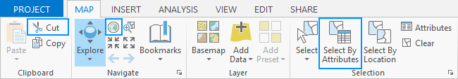  

The *disableIfBusy* element is used to signal that the control should be disabled whenever the primary worker thread is busy. This prevents work from queuing up. This element is true by default. Controls that always need to be enabled should set this to false.  

All control declarations support a condition attribute allowing the assignment of a condition.  If the specified condition isn’t met, the control will be automatically disabled by the framework.  In addition, controls remain unloaded until their condition is met.  If no condition is specified, the control is assumed to be always relevant. See the ‘Condtions and State’ section for more information.  

Controls are implemented by inheriting from the appropriate plug-in derived base class.  

The Button class shown below is typical of controls:  the virtual *OnClick* is overridden by the leaf class and used to perform whatever custom behavior is desired.  

```C#
sealed class ShowPeopleSheet : ArcGIS.Desktop.Framework.Contracts.Button
{
  protected override void OnClick()
  {
    User user = new User();
    user.FirstName = "Michael";
    user.LastName = "Faraday";
    PropertySheet.Show("UserManager", null, user);
  }
}
```

Controls can update their properties, e.g. caption and tooltip, at run-time and these changes will automatically reflect in the application.   

```C#
  protected override void OnClick()
  {
    this.Caption = "New Caption";
    this.Tooltip = "New Tooltip";
    this.Checked = true;
  }
```
All controls can be accessed and updated at run-time using the *FrameworkApplication.GetPlugInWrapper* function.

```C#
  protected override void OnClick()
  {
    IPlugInWrapper wrapper = FrameworkApplication.GetPlugInWrapper("acme_ZoomBtn");
    wrapper.Caption = "New Caption";
    wrapper.Tooltip = "New Tooltip";
  }
```
To support accessibility, an appropriate keytip should be supplied for each control.  The character/s chosen should make sense and should not conflict with any existing keytips; keytips can consist of multiple characters to disambiguate if necessary.  

###Buttons and Checkboxes

Buttons are simple controls that respond to an *OnClick* event. Use the Checked property for a checked appearance.  

```xml
<button id="acme_AddFromFileButton"
    className=" AddFromFile"
    caption="Add from file"
    keytip="AF"
    largeImage="Images\AddFromFile32.png"
    smallImage="Images\AddFromFile16.pngg">
  <tooltip heading="Add from file" image="Images\AddFromFile16.png">
    Add spatial data files to the project
    <disabledText>Requires an open project with a map</disabledText>
  </tooltip>
</button>
```

Buttons are implemented by deriving from the Button base class.

```C#
sealed class AddFromFile : ArcGIS.Desktop.Framework.Contracts.Button
{
  protected override void OnClick()
  {
    base.OnClick();
  }
}
```
###CheckBoxes

Check boxes work exactly the same as buttons.  

```xml
<checkBox id="acme_AutoSave"
          className="AutoSave"
          caption="Auto Save"
          keytip="AS">
  <tooltip heading="Auto Save" image="Images\AutoSave16.png">Automatically save edits.</tooltip>
</checkBox
```

###Tools

Tools look very similar to buttons except they automatically stay checked after being selected. Tools also work in conjunction with the current pane—all unhandled mouse and keyboard events from the active pane are passed to the active tool for processing.  

```xml
<tool id="acme_zoomTool"
      caption="Zoom"
      className="ZoomTool"
      keytip="ZT">
  <tooltip heading="Zoom" image="Images\Zoom16.png">Zoom the map.
    <disabledText>No active map.</disabledText>
  </tooltip>
</tool>
```
Tools are implemented by deriving from the Tool base class.

```C#
sealed class ZoomTool : ArcGIS.Desktop.Framework.Contracts.Tool
{
  protected override void OnMouseDown(MouseButtonEventArgs e)
  {
    // Do work
    e.Handled = true;
  }

  protected override void OnMouseUp(MouseButtonEventArgs e)
  {
    switch (e.ChangedButton)
    {
      case MouseButton.Right:
        e.Handled = true;
        ContextMenu menu = FrameworkApplication.CreateContextMenu("acme_AddDataMenu");
        menu.IsOpen = true;
        break;
      // etc …
      }
  }
}
```
A default tool can be assigned when declaring a pane; this tool will be automatically selected when an instance of the pane is created.  When working with multiple panes, the active tool may change automatically to reflect the incoming pane.  When returning to the old pane, the system will try to re-activate the most recently used tool for the pane type.    

###Edit Boxes

Edit Boxes provide a convenient means for users to enter text within a control on a ribbon tab.  The edit box can be configured to appear with or without a caption.  The *sizeString* attribute is used to establish the width of the control through a string that is representative of the kind of input that will appear in the control; the edit hint can also be updated at runtime. Use the *DataType* attribute (string, double, or int) to specify the type of edit box and the format attribute to control the representation of numeric values.  

```xml
<editBox id="acme_Currency" caption="Currency:"
         className="CurrencyEditBox"
         dataType="double"
         format="C" keytip="CC" 
         sizeString="$9.99"/>
```

Edit Box controls are implemented by deriving from the EditBox base class.  

```C#
sealed class CurrencyEditBox : ArcGIS.Desktop.Framework.Contracts.EditBox
{
  protected override void OnEnter()
  {
    // Do work
  }
}
```

C# Format examples:  

```C#
    decimal value = 123.456m;
    Console.WriteLine(value.ToString("C2"));
    // Displays $123.46

    value = -12345;
    Console.WriteLine(value.ToString("D"));
    // Displays -12345
    Console.WriteLine(value.ToString("D8"));
    // Displays -00012345
```

###Combo Boxes

The ComboBox allows users to select an item from a drop-down list or optionally to enter new text in the text box of the control. A ComboBox typically contains a collection of ComboBoxItem objects but can contain a collection of objects of any type (such as string or image).

The *IsEditable* and *IsReadOnly* attributes specify how the ComboBox behaves.  


<table>
<tr>
<th></th><th>IsReadOnly true</th><th>IsReadOnly false</th>
</tr>
<tr>
<th rowspan="4">IsEditable true</th>
<td>Cannot select an item in the ComboBox by entering a string.</td>
<td>Can select an item in the ComboBox by entering a string.</td>
</tr>
<tr>
<td>Cannot enter a string that does not correspond to an item in the ComboBox.</td>
<td>Can enter a string that does not correspond to an item in the ComboBox.</td>
</tr>
<tr>
<td>Can select part of the string in the ComboBox text box.</td>
<td>Can select part of the string in the ComboBox text box. </td>
</tr>
<tr>
<td>Can copy the string in the ComboBox text box, but cannot paste a string into the ComboBox text box.</td>
<td>Can copy or paste the string in the ComboBox text box.</td>
</tr>
<tr>
<th rowspan="4">IsEditable false</th>
<td>Can select an item in the ComboBox by entering a string. </td>
<td>Can select an item in the ComboBox by entering a string. </td>
</tr>
<tr>
<td>Cannot enter a string that does not correspond to an item in the ComboBox. </td>
<td>Cannot enter a string that does not correspond to an item in the ComboBox. </td>
</tr>
<tr>
<td>Cannot select part of the string in the ComboBox. </td>
<td>Cannot select part of the string in the ComboBox. </td>
</tr>
<tr>
<td>Cannot copy or paste the string in the ComboBox.</td>
<td>Cannot copy or paste the string in the ComboBox.</td>
</tr>
</table>

In most cases combo boxes are filled with **ComboBoxItem** objects but you can fill them with any object you’d like.  When custom items are added to a combo box a custom item template usually used.

```xml
<comboBox id="acme_ComboBox1" 
          caption="ComboBox 1" 
          className="ComboBox1" 
          itemWidth="140" 
          isEditable="false"
          isReadOnly="true" 
          resizable="true">
  <tooltip heading="Tooltip Heading">Tooltip text<disabledText /></tooltip>
</comboBox>
```

Combo boxes are implemented by deriving from the ComboBox base class.

```C#
sealed class AcmeCombo : ArcGIS.Desktop.Framework.Contracts.ComboBox
{
  public AcmeCombo()
  {
    FillCombo();
  }

  private void FillCombo()
  {
    // Add 6 items to the combobox
    for (int i = 0; i < 6; i++)
    {
      string name = string.Format("Item {0}", i);
      Add(new ComboBoxItem(name));
    }

    // Select first item
    SelectedItem = ItemCollection.FirstOrDefault();
  }

  protected override void OnSelectionChange(ComboBoxItem item)
  {
    // Do work    
  }
}
```

###Spinners

Spinners edit doubles like an edit box except they additionally provide increment and decrement buttons and support a range established with the *minimum* and *maximum* attributes. You can also specify default and *increment* values. Use the format attribute to control how the double is displayed. For example, use 'C' to present a currency or F4 for a double with 4 decimals. In addition, use the *suffix* attribute to tag on a trailing string such as a '%' sign.  

Spinners do not support delay loading with *loadOnClick*, they are instantiated when they become visible.

```xml
<spinner id="acme_spinner" 
         caption="Spin" 
         className="RotateSpinner" 
         format="F1" 
         defaultValue="45"
         maximum="90" 
         minimum="0"
         increment="1" 
         keytip="dz" 
         suffix="&#176;">
  <tooltip image="Images\Angle16.png" heading="Rotate">Specify rotation angle
    <disabledText>No item selected.</disabledText>
  </tooltip>
</spinner>
```
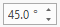  

Spinner controls are implemented by deriving from the Spinner base class.

```C#
sealed class RotateSpinner : ArcGIS.Desktop.Framework.Contracts.Spinner
{
  protected override void OnValueChanged(double? value)
  {
    // Do work
  }
}
```

###Dynamic Menus

Unlike regular menus, which are purely declarative (defined only in DAML), dynamic menus are populated at run-time. Derived classes must add items in their *OnPopup* override which is invoked before the menu opens. Dynamic menus may contain simple items consisting of a caption and image, or references to existing DAML controls including other dynamic menus. The *OnClick* override is invoked with the specified index when an item is clicked. All menu items are cleared after the popup closes.  

Dynamic menus can reside directly on the ribbon or on other menus. If the dynamic menu is on a menu and the inline attribute is set to true, the items will be added directly onto the hosting menu instead of being added to a pull-right submenu.   

```xml
<dynamicMenu caption="Acme Menu"
              className="DynoMenu"
              id="acme_dynoMenu"
              largeImage="Images\MenuImage32.png"
              smallImage="Images\MenuImage16.png" >
  <tooltip heading="Heading" image="Images\MenuImage16.png">Some text</tooltip>
</dynamicMenu>
```

Dynamic menus are implemented by deriving from the DynamicMenu base class. The example below shows three types of buttons being added: a delegate menu item, a regular menu item, and several DAML buttons.  

```xml
sealed class DynoMenu : ArcGIS.Desktop.Framework.Contracts.DynamicMenu
{
  internal delegate void MathAction(double number);

  protected override void OnPopup()
  {
    double angle = 28.0;

    MathAction action = Test;

    this.Add("item 1", @"pack://application:,,,/Images/Image1.png", true, true, false, action, angle);
    this.Add("item 2", @"pack://application:,,,/Images/Image2.png");
    this.AddSeparator();
    this.AddReference("acme_basicButton");
    this.AddReference("acme_basicMenu");
    this.AddReference("acme_basicGallery");
  }

  protected override void OnClick(int index)
  {
    switch (index)
    {
      case 1:
        System.Windows.MessageBox.Show("2nd item");
        break;
    }
  }

  private void Test(double angle)
  {
    System.Windows.MessageBox.Show(angle.ToString());
  }
}
```
##Container Controls

All the ribbon controls we have looked at so far have been declared under the controls element as they represent individual controls. The remaining ribbon controls are containers controls meaning they hold a collection of controls. For example, a menu is a list of controls. Each type of container control has its own section in DAML.  

###Menus

Menus are purely declarative and these are added under the menus element. Menus can hold a variety of controls including buttons, dynamic menus, galleries, and other menus.  

```xml
<menu id="acme_mainMenu"
      caption="Main Menu"
      largeImage="Images\MenuImage32.png"
      smallImage="Images\MenuImage16.png">
  <button refID="acme_paste"/>
  <button refID="acme_pasteSpecial"/>          
</menu>
```

###Split Buttons

Split buttons group related buttons together. The first button listed should be the mostly common used button in the collection and it is presented directly on the ribbon. The remaining buttons are less frequency used and these are added to a drop down menu. Split buttons are purely declarative, they have no associated action portion. Each button participating in the control has an active portion but not the split button itself.  

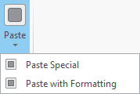   

```xml
<splitButtons>
  <splitButton id="acme_pasteSplitBtn">
    <button refID="acme_paste" />
    <button refID="acme_pasteSpecial" />
    <button refID="acme_pasteWithFormatting" />
  </splitButton>
</splitButtons>
```
Instead of a collection of less commonly used buttons, split buttons can instead present a gallery. The first element is still a button. As we’ll see later, galleries can additionally present their own menu of buttons.  

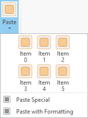  

```xml 
<splitButtons>
  <splitButton id="acme_pasteSplitBtn">
    <button refID="acme_paste" />
    <gallery refID="acme_pasteGallery" />
  </splitButton>
</splitButtons>
```

###Palettes (Button and Tool)

Palettes are designed specifically for grouping a set of related buttons or tools together.  When a tool is selected from the palette of tools, it becomes the active tool and is displayed as the new palette button. Like split buttons, palettes are purely declarative, only the actual buttons and tools have an active portion.  

```xml
<toolPalettes>
  <toolPalette id="examplePalette" caption="Example">
    <tool refID="tool1"/>
    <tool refID="tool2"/>
  </toolPalette>
</toolPalettes> 
```
The first tool listed in the palette is the initial tool displayed in the panel. 

###LabelControl

If you just want to add a string to the ribbon you can use the LabelControl.

```xml
<labelControl id="acme_label" 
              caption="the quick brown fox jumps over the lazy dog" 
              hasTwoLines="true"/>
```
!Addintab.png](../images/Proconcepts-Frameworks/Addintab.png "Framework_Guide Addintab.png")  

###Galleries

A Gallery is a control that displays a collection of related items or Commands in the Ribbon. If there are too many items in the gallery, an expand arrow is provided to display the rest of the collection in an expanded pane. Galleries typically provide a richer representation of the choices offered, each often representing a preview of the result if chosen. Galleries can be organized to show multiple rows and columns simultaneously and are excellent choices when you don’t want to be constrained by the smaller one dimensional area offered by a menu.  

The graphic below shows the Basemap drop-down gallery.  

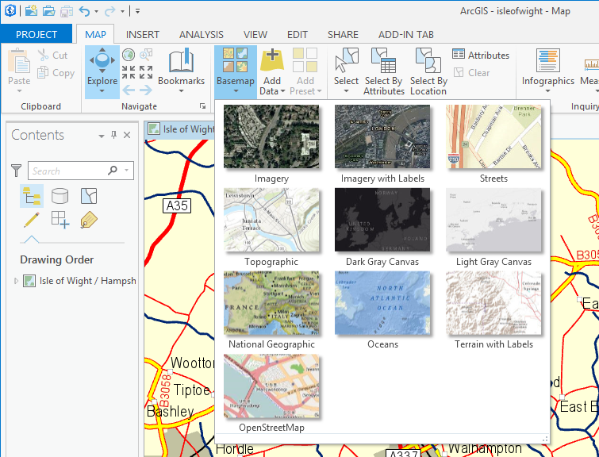  

Galleries can present a condensed grid within the ribbon itself using the in-line gallery representation.  The items presented in this fashion are often either the most common or most recently used items depending on the implementation.  The graphic below shows the Layer Templates in-line gallery.  

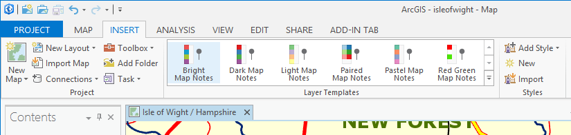  

The actual contents of a gallery are populated at runtime.  Relatively static aspects such as the caption, the dropdown image, item size constraint, tooltip, etc. are specified declaratively.  

Gallery items are typically modeled through the *GalleryItem* class. *GalleryItems* have the following properties: *Icon, LargeIcon, Text, Group, and Tooltip*. Custom *GalleryItems* can be created through inheritance to encapsulate any additional properties and/or behavior as needed.  

Gallery items are represented in the UI via an ItemTemplate. Galleries can specify a custom template in their declaration. A simple default template is used for all galleries that do not specify one. This template assumes a collection of *GalleryItems*; if you are using your own item template, you can fill the collection with whatever type is appropriate.  

Note, when specifying a custom template, you must list the file and its key. Also, if you want grouping, make sure the objects expose a public Group property of type string as the binding logic uses this.  

To better support a responsive UI experience, the framework provides a waiting spinner and loading message on the gallery’s dropdown when it is trying to asynchronously load a large number of items. The *LoadingMessage* can be updated at runtime or set statically using the *loadingMessage* attribute. Note, to get this default behavior, no heavy code should be put in the gallery’s constructor since it will block the UI thread and prevent the spinner from showing up. The loading message only appears in drop down galleries (not in-inline).  

All items added to the ItemCollection must be created on the main UI thread as these ultimately become the content of buttons added to the gallery popup control.  

Galleries are declared in DAML under the *galleries* element.  

```xml
<gallery id="acme_MapGallery" 
         className="acme_Maps"    
         caption="Maps" 
         itemsInRow="3" 
         itemWidth="140" 
         dataTemplateFile="pack://application:,,,/Acme;component/Styles/GalleryTemplates.xaml" 
         templateID="MapItemTemplate" 
         showItemCaption="true" 
         resizable="true" 
         largeImage="Images\Basemap32.png">
  <tooltip>Choose a map.</tooltip>
  <button refID="acme_Button1"/>
  <button refID="acme_Button2"/>
</gallery>
```

Galleries can also have a menu presenting additional options. This menu may contain another nested gallery.  

Galleries are implemented by inheriting from the framework Gallery base class.   

```C#
sealed class MapGallery : ArcGIS.Desktop.Framework.Contracts.Gallery
{
  private bool _initialized;

  protected override void OnDropDownOpened()
  {
    LoadItems();
  }

  private void LoadItems()
  {
    if (_initialized)
      return;

    for (int x = 0; x < 28; x++)
    {
      GalleryItem galleryItem = new GalleryItem("GalleryItem " + x.ToString(), null, "tip: " + x.ToString());
      this.Add(galleryItem);
    }
    _initialized = true;
  }

  protected override void OnClick(GalleryItem item)
  {
    System.Windows.MessageBox.Show(item.Text);
  }
}
```

##Tabs and Groups

You’ll note that declaring a control does not establish where and how the control will actually appear.  The location controls within the ribbon, including their size and relative placement, is established using the *group* and *tab* elements.  

ArcGIS Pro uses the ribbon paradigm popularized by newer versions of Microsoft Office.  The ribbon consists of a single fixed toolbar containing one or more tabs. The number of available (visible) tabs may vary dynamically depending on the state of the application. Tabs are activated through user interaction (clicks), or when directed by code running within the application.  

Each tab is itself composed of one or more groups, small rectangular regions having a caption and containing one or more controls.  The representation of controls within groups varies depending on how frequently the control is expected to be used, and is configured declaratively in the DAML.  Frequently used controls should be large and obvious, while less frequently used tools should be smaller.  In addition, controls are typically paired with a caption to make their function more obvious.  

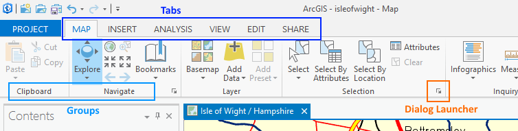  
 
Groups may optionally support a “dialog launcher” button—a small link widget located next to the group caption—which is used to bring up a dialog where more obscure functions may be accessed.  Groups are declared as lists of controls within a *groups* container element:  

```xml
<groups>
  <group id="esri_mapping_navigateGroup" caption="Navigate" 
         launcherButtonID="esri_mapping_navigationOptionsButton" 
         smallImage="Images/3DNavigationTool16.png" 
         launcherKeytip="NG">
    <tool refID="esri_mapping_exploreSplitButton" size="large" />
    <button refID="esri_mapping_zoomFullButton" size="small" />
    <button refID="esri_mapping_fixedZoomInButton" size="small" />
    <button refID="esri_mapping_prevExtentButton" size="small" />
    <button refID="esri_mapping_zoomToSelectionButton" size="small" />
    <button refID="esri_mapping_fixedZoomOutButton" size="small" />
    <button refID="esri_mapping_nextExtentButton" size="small" />
    <gallery refID="esri_mapping_bookmarksNavigateGallery" inline="false" size="large" />
  </group>  
  <group id="esri_mapping_labelingLayerGroup" caption="Layer"
       smallImage="Images/LabelingRibbonLayer16.png" keytip="ZL">
    <button refID="esri_mapping_labelLayerEnableButton" size="large" />
  </group>
  <group id="esri_mapping_labelingGroup" caption="Labeling"
         smallImage="Images/MapRibbonLabeling16.png" keytip="ZL">
    <button refID="esri_mapping_labelPauseButton" size="middle" />
    <button refID="esri_mapping_labelViewUnplacedButton" size="middle" />
    <menu refID="esri_mapping_labelingOptionsMenu" size="middle"/>         
  </group>
</groups>
```

In the example above, several groups are declared and each group lists its contents. Note that the elements refer to previously declared controls. Notice how buttons, for example, specify their image in their declaration under controls but their size is specified on the group. This is because the same control can appear differently in more than one group (large in group A but small in group B). Use a label control to provide additional textual information for a group; use a separator to segregate multiple controls in the same group.  

The visibility of groups cannot be controlled independently from their parent tab; i.e., groups do not appear, disappear, or move on their parent tab while the application is running.  

Like controls, existing groups can be modified in DAML. The following example inserts a new button into an existing group and removes a button.  

```xml
<updateModule refID="esri_mapping">
  <groups>
    <updateGroup refID="esri_mapping_navigateGroup">
      <insertButton refID="acme_FullExtent" 
                    insert="before" 
                    placeWith="esri_mapping_zoomFullButton" 
                    separator="true"/>
      <deleteButton refID="esri_mapping_fixedZoomOutButton"/>
    </updateGroup>
  </groups>
</updateModule>
```

Once a group is declared, it can be referenced and placed on tabs. Tabs are declared as lists of groups within a tabs collection element.  In the following example, the previously declared groups are added to a new tab labeled “Home”.  

```xml
<tabs>
  <tab id="esri_mapping_homeTab" 
       caption="MAP" 
       condition="esri_mapping_pane_core" 
       keytip="M">
    <group refID="esri_core_clipboardGroup" />
    <group refID="esri_mapping_navigateGroup" />
    <group refID="esri_mapping_mapGroup" />
    <group refID="esri_mapping_selectionGroup" />
    <group refID="esri_mapping_inquiryGroup" />
    <group refID="esri_mapping_labelingGroup" />
  </tab>
</tabs>
```

Like controls, a tab’s relevance can be governed using a condition. The condition attribute is used to control whether or not the tab is visible, and thus available. Conditions are not used to control tab activation, only tab availability. If no condition is specified, the tab will always be visible.  

Collections of related tabs can be grouped together in colored, named groups to improve clarity.  These collections are called tab groups.  In the ribbon displayed below, there is a tab group containing three tabs.   

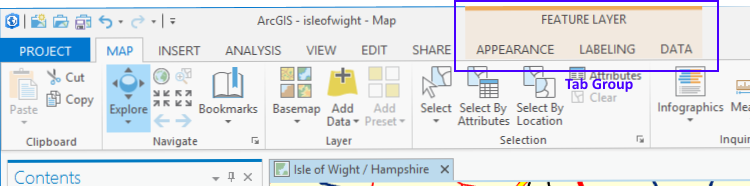  

Tab groups are declared within a tabGroups collection element and consist of an id, color, and a caption.  Tabs are associated with a tag group using the tabGroupID attribute.
<tabGroups>
  <tabGroup caption="FEATURE LAYER" id="esri_mapping_featureLayerTabGroup">
    <color A="255" R="238" G="170" B="90" />
    <borderColor A="0" R="251" G="226" B="195" />
  </tabGroup>
</tabGroups>

<tab id="esri_mapping_featureLayerAppearanceTab" 
     caption="APPEARANCE" 
     condition="esri_mapping_onlyFeatureLayersSelectedCondition" 
     tabGroupID="esri_mapping_featureLayerTabGroup" 
     keytip="JA">
  <group refID="esri_mapping_layerScaleVisibilityGroup"/>
  <group refID="esri_mapping_layerEffectsGroup" />
  <group refID="esri_mapping_layerSymbology" />
  <group refID="esri_mapping_layerExtrusion" />
  <group refID="esri_mapping_layer3DGroup" />
</tab>

Tab groups are typically used in situations where the user temporarily enters a mode, such as “editing graphic elements.”  Tag groups are not typically used with tabs which are perpetually visible (global tabs). Tabs in a tab group should have the same *condition*. If any tab in a tab group has a relevant condition, the entire tab group is displayed.  

##Toolbars

The ribbon group supports an inner collection/grouping of controls into a toolbar. Toolbars are purely declarative and their definition describes what the toolbar looks like according to how much space is available in the ribbon. Toolbars want to draw as one long control; if there are size constraints, the toolbar will stack its groups to save real estate. For example, when there is a lot of room in the ribbon, such as when the user expands the main window, all of the toolbar’s group may appear in one long row; as the application shrinks, the toolbar will move successive groups underneath one another. Only one toolbar should be declared in a group. The example below shows a toolbar with several combo boxes and buttons.  

```xml
<toolbars>
  <toolbar id="esri_mapping_labelTextSymbolFontToolbar">
    <group>
      <comboBox refID="esri_mapping_labelTextSymbolFontFamilyComboBox" />
      <comboBox refID="esri_mapping_labelTextSymbolFontSizeComboBox"/>
      <button refID="esri_mapping_labelTextSymbolIncreaseSizeButton"/>
      <button refID="esri_mapping_labelTextSymbolDecreaseSizeButton" />
    </group>
    <group>
      <comboBox refID="esri_mapping_labelTextSymbolFontStyleComboBox" />
      <customControl refID="esri_mapping_labelTextSymbolColorPicker"/>
    </group>
  </toolbar>
</toolbars>
```

##Panes

The framework supports multiple panes, letting users display and interact with multiple subjects.  Only one pane can be active at a time. The active pane establishes what is available on the ribbon; switching between different panes may result in changes to what tabs and controls are available. The active pane represents what the user is working with at any given time and therefore provides the primary context for the application. You can open many panes at the same time and these can be grouped, tiled (horizontally or vertically), or floated.   

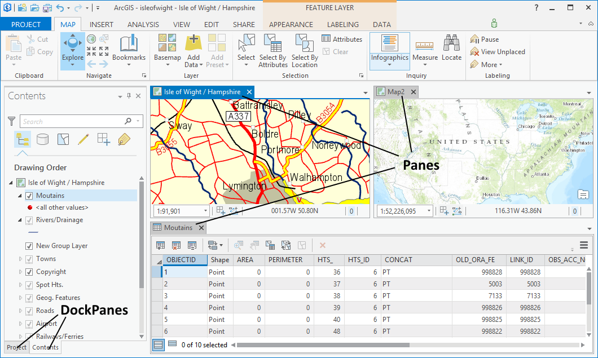  
 
Panes are declared within a panes collection element:  

```xml
<panes>
  <pane id="acme_MapPane" 
        caption="Map" 
        className="MapPane" 
        smallImage="Images\Map16.png" 
        loadingMessage="Initialize..."
        defaultTab="acme_MapTab" 
        defaultTool="acme_ZoomTool">
    <content className="MapPaneView"/>
  </pane>
</panes>
```

Panes can be associated with a default tab, and/or a default tool such that if no other relevant tool/tab is already selected, the default will automatically be selected when the pane is activated.   

Panes are composed of three parts: a DAML definition, a controller, and a view. The controller is similar to what we’ve seen with custom controls and must inherit from the Framework’s Pane base class.  The view component is the custom appearance of the control and this class typically derives from a WPF UserControl. The DAML *className* attribute defines the controller and the content element defines the view. When the pane in instantiated, the controller is set as the data context of the view. This allows for a view/view-model relationship and all the benefits that accompany this pattern.  

```C#
class MapPane : ArcGIS.Desktop.Framework.Contracts.Pane
{
  protected override Task InitializeAsync()
  {
    // Initialize instance...
    return Task.FromResult(0);
  }

  protected override Task UninitializeAsync()
  {
    // Uninitialize instance...
    return Task.FromResult(0);
  }

  protected override void OnActivate(bool isActive)
  {
    // Called when activated/deactivated
  }
}
```

Panes are managed by the *PaneCollection* class which is available via *FrameworkApplication.Panes*. Panes are created programmatically using the *PaneCollection.Create* method.  This method has an additional overload which allows the caller to pass user defined data; the appropriate constructor will be called on the pane derived class depending on which version of Create is called.   After the pane’s constructor is called, the pane’s *InitializeAsync* function is called to give it a chance to initialize asynchronously if necessary. Similarly, when a pane is closed, its *UninitializeAsync* function is called. The *PaneCollection* class also holds the *ActivePane* and has methods for finding and activating existing panes.  

Each pane instance has an associated instance identifier *(InstanceID)* which allows users to differentiate between multiple instances of the same pane. Panes can further override *ContentID* to provide a custom identifier.  

Panes directly receive mouse and keyboard events; if not handled, the events are forwarded to the current tool if active.  

As we’ll see in more detail in the Undo/Redo section, Panes and DockPanes play a critical role in governing application operations.  

##DockPanes

In addition to panes, the framework also supports dock panes which often supplement panes by providing more context. Dock panes are modeless dialogs that can be docked at the top, right, left, or bottom of the view area within the application. Dock panes can also be grouped with other dock panes and docked relative to each other (i.e. below, above, etc), and can also be un-docked and floated.  Finally, dock panes support being pinned/un-pinned so that they slide back into the application frame to save space.  The application framework persists and preserves the docking state of each dock pane so that when shown in subsequent sessions they appear in the same positions.  

Dock panes are singletons, there is never more than one instance of a particular dock pane and once created, they are not destroyed until the application shuts down.  

Dock panes are defined in the same fashion as panes. When the framework creates a dock pane, it will also create its content class and set the content’s data context to the dock pane. This automatic binding allows you to use the MVVM pattern when developing panes and dock panes. For example, a well-designed dock pane will have as little logic as possible in its XAML code behind; instead, all of the controls in the XAML should be bound to properties in the dock pane base class. The dock pane and pane bases classes can be regarded as view-models.  

```xml
<dockPanes>
  <dockPane id="acme_TOCDockPane" 
            caption="Contents" 
            className="TOCDockPaneViewModel" 
            dock="group"  
            dockWith="esri_core_ProjectDockPane"
            condition="acme_Mapping">
    <content className="TOCDockPaneView"/>
  </dockPane>
</dockPanes>
```

Dock panes can be declared such that they are positioned relative to other dock panes using the *dockWith* attribute. In the example above, the dock pane declares that the first time it appears it should be grouped with the ‘esri_coreProjectDockPane’ dock pane. Note, from here on, every time this dock pane is presented, its location will come from its persisted dock state to support user relocation. Dock panes are also conditional, they can be made to appear automatically whenever the application reaches a defined state. If a dock pane does not specify a state it is considered global and will be presented automatically at start-up. See the Conditions section for more details.  


All dock panes must derive from the *DockPane* base class which in turn inherits from the *PlugIn* base class. Dock panes are managed by the *DockPaneManager* class available via *FrameworkApplication.Dockpanes*. Dock panes are found rather than created since they are logically singletons. Use *FrameworkApplication.DockPanes*.Find to find and create dock panes.

```xml
class TOCDockPaneViewModel : ArcGIS.Desktop.Framework.Contracts.DockPane
{
  protected override Task InitializeAsync()
  {
    // Initialize instance...
    return Task.FromResult(0);
  }

  protected override Task UninitializeAsync()
  {
    // Uninitialize instance...
    return Task.FromResult(0);
  }

  protected override void OnActivate(bool isActive)
  {
    // Called when activated/deactivated
  }
}
```

##Property Sheets and Pages

Property sheets hold a collection of individual unrelated property pages. Each page contains controls for setting a group of related properties. A property sheet can be shown modal or modeless. 

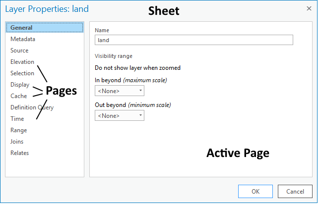   

Property sheets are purely declarative, they are defined only in DAML and have no corresponding managed class. Property pages, like panes and dock panes, have both declarative and active components; the active portion of all property pages must derive from the *ArcGIS.Desktop.Framework.Contracts.Page* class. The view class typically derives from WPF’s *UserControl*.

```xml
<propertySheets>
  <insertSheet id="acme_mainSheet"
                caption="Options">
    <page id="acme_mainOptions"
          caption="Settings"
          className="SettingsPage">
      <content className="SettingsPageView"/>
    </page>
            
  </insertSheet>      
</propertySheets>
```

Property pages only load when they become visible. They are not loaded when the sheet loads - the page has to be visited. When a page does load, its *Page.IsLoading* property is first set to true. Next, its *Page.InitializeAsync* function is executed; when the returned task completes, its *IsLoading* is reset to false.  

Property pages have the option of being conditional. If a condition has been specified for the page in DAML, the page will not appear with the sheet unless its condition is currently satisfied.  

Pages can also be grouped within a sheet by setting the sheet's *hasGroups* attribute to true and specifying a group heading by setting the page's group attribute.  

When a property sheet is displayed with either *PropertySheet.Show* or *PropertySheet.ShowDialog*, data can be passed in as one of the arguments and all of its pages can access the data using their *Page.Data* property. 

The property sheet dialog includes a title bar and several buttons: OK, Cancel, and Apply. The Apply button is only presented when the sheet is modeless. The OK button remains enabled as long as all pages report that they are valid *(Page.IsValid)*. The Apply button enables once any page in the sheet sets its *Page.IsModified* property to true and all page are valid. Once Apply or OK are clicked, each page that has set its *IsModified* flag to true will have its *CommitAsync* invoked. Similarly, if the Cancel button is clicked, their *CancelAsync* is invoked.  

Finally, when a property sheet closes, each loaded page will have its *Page.Uninitialize* invoked where they can perform any necessary cleanup.

##Backstage  

The Backstage is a full-screen user interface view that exposes additional functionality for the application and current project. The backstage consists of tabs and buttons. Each tab is scoped to a particular task and presents its own user interface. Buttons are simply commands that perform an operation and have no additional user interface in the backstage.  

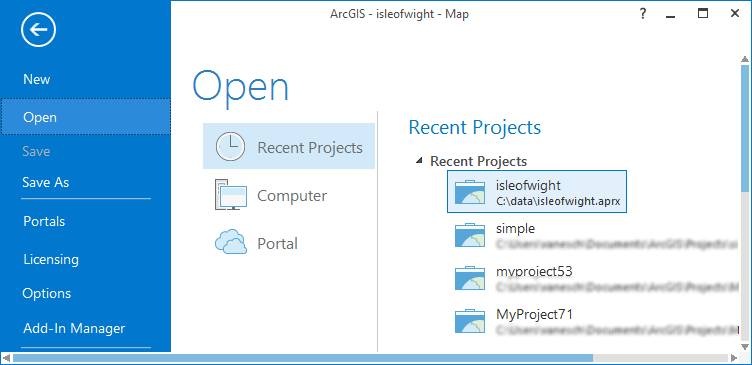  
 
Backstage tabs are also contextual and will appear disabled in they specify a condition that has not been satisfied.  

Like panes, dock panes, and property pages, a custom backstage tab has two components: a component class that derives from *BackstageTab* and a view class that derives from *FrameworkElement*, typically a UserControl. Backstage tabs must be defined in DAML.  

```xml
<backstage>
  <insertButton refID="acme_Save"/>
  <insertTab id="acme_Open"
              caption="Open"
              className="AcmeOpenProjectCmd"
              keytip="OO">
    <content className="AcmeOpenProjectView"/>
  </insertTab>
  <insertButton refID="acme_Exit"/>
</backstage>
```

###The Run-time API
Having introduced the many framework types, let’s now take a simplified view of the run-time API. The main object in the framework graph is the FrameworkApplication object which represents the running application. From FrameworkApplication you can access the PaneCollection which holds the currently open Panes and lets you create new ones. The FrameworkApplication also provides a reference to the DockPaneManager which allows you to find and create DockPanes. The PropertySheet class has static methods to show a specified sheet. The Categories class expose a static method to get components registered in a particular category.  

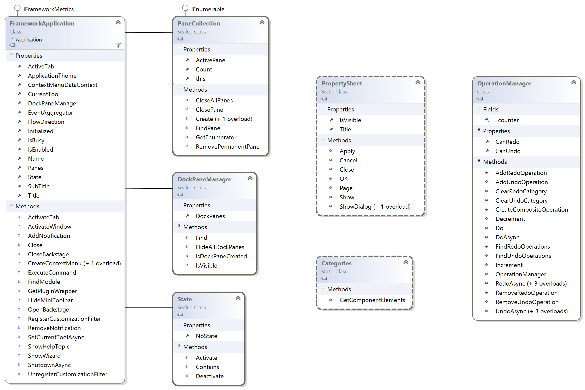  
 
##Conditions and State

The framework incorporates a mechanism for triggering the activation of customizations based on user defined conditions. Unlike classic events or callbacks, the binding between condition and customizations is provided statically—declaratively—using DAML. This mechanism provides a simplified and declarative means for expressing when various GUI elements such as ribbon tabs, dock panes, buttons and tools should and shouldn’t be visible or enabled within the application.  The goal here is to present an uncluttered user interface “tuned” for the activity currently at hand.  Using conditions also ensures that code modules and their associated resources are loaded and consumed only when they are relevant.  The use of Conditions and State also simplifies coding by greatly reducing the need for complex and largely redundant event wiring associated with more traditional models.  

Before diving into how context triggered activation actually works, two important terms need to be defined:  

**State:**  States are named Boolean values that symbolize a particular aspect of the application’s overall status; for example, whether a particular view is active, or whether a particular type of feature is selected. States are declared using ordinary character strings; to avoid name collisions, they are typically named using the PlugIn naming convention.   

**Condition:**  Conditions are DAML expressions composed of one or more states, such as (A or B), where both A and B are states. Conditions themselves are named so that they can be referenced by those DAML elements that permit the use of conditions; for instance, a custom ribbon tab can automatically become visible when a map view is active, and hide when any other type of view is active.   

###Declaring States and Conditions  

States and Conditions are declared using DAML elements as follows:  

*A simple condition (consisting of only one state):*

```xml
<conditions>
  <insertCondition id="aSimpleCondition">
    <state id="someState"/>
  </insertCondition>
</conditions>

A more complex condition:

<conditions>
  <insertCondition id="aMoreComplexCondition">
    <and>
      <state id="someState"/>
      <or>
        <state id="someOtherState"/>
        <state id="yetAnotherState"/>
      </or>
    </and>
  </insertCondition>
</conditions>
```

The above condition evaluates to (someState AND (someOtherState OR yetAnotherState)).   

Conditions are defined at the root level in the DAML file—outside the scope of any module block—since they are simply expressions (without an active aspect), and do not need to be associated with any controlling module; conditions should be considered global in scope.  The Boolean operators And, Or, and Not can be combined recursively to form complex conditional expressions if necessary, but conditions themselves cannot be used (recursively) in place of  states within another Condition block.    

Conditions are associated with a particular plug-in using the *condition* attribute. The xml fragment below specifies that this tab should appear whenever the active view is a map view.  

```xml
<tab id="myTab" caption="New Tab" condition="esri_mapping_MapView"/>
```

###State Activation

The framework defines a fixed set of activation behaviors that can be triggered using conditions. States are maintained in state tables, where state is said to be activated if the state exists in the table, and deactivated otherwise. While the application runs, the state tables within the framework are periodically monitored for changes. When a change is detected, the tables are matched against any conditions currently defined, and the appropriate activation (or deactivation) is triggered in response.  

The following table summarizes the currently defined activation behaviors along with the type of Plugins they apply to:  

<table>

<tr>
<th width ="25%">Plugin Type</th><th width="75%">Framework Provided Activation</th>
</tr>
<tr>
<td>Ribbon Tab</td><td>Tab is shown or hidden based on the associated condition.  When the tab first appears, other objects which appear on the tab may load if they are visible.</td>
</tr>
<tr>
<td>DockPane</td><td>DockPane is shown based on the associated condition.  The DockPane object itself will not be loaded or created until the condition is initially met.</td>
</tr>
<tr>
<td>Controls (Buttons, Tools, Etc.)</td><td>Control plug-ins are enabled and disabled based on their associated condition. The Control Plugin object itself will not be loaded or created until the condition is initially met, and thereafter, OnUpdate will not be called unless the supplied context is currently satisfied.  Note that the loadOnClick attribute is checked after the Condition, so loadOnClick controls will still appear disabled if their Condition hasn’t yet been satisfied. <br> Buttons and checkboxes also have a checkedCondition whereby their checked state is automatically set based on their specified condition.</td>
</tr>
<tr>
<td>BackStage</td><td>BackStage tabs, like Controls, are disabled if they specify a condition that is no satisfied.</td>
</tr>
<tr>
<td>Property Sheet Page</td><td>Pages that specify a condition will not appear in a property sheet if the condition is not met.</td>
</tr>
</table>

###Implicit and Explicit State  

States can be either implicit or explicit. Implicit states are those which are intrinsically defined and controlled by the framework itself; these states are activated and deactivated automatically.   

The framework currently defines the following implicit states:  

<table>
<tr>
<th width="25%">Implicit State</th><th width="75%"">Details</th>
</tr>
<tr>
<td>Active Pane</td><td>The ID of the active Pane is designated as an implicit state and activated when the pane is active.</td>
</tr>
<tr>
<td>Module Loaded</td><td>When a module is loaded, its ID is designated as an implicit state and activated.  When unloaded, its ID is deactivated.</td>
</tr>
</table>

*Explicit* states are set manually using developer supplied code; the meanings of these states are usually defined by the developer and used to identify more specific types of context such as custom modes; i.e.: “I’m editing”, or a custom status: “a raster layer is selected in the TOC.”   

Explicit state changes are made by calling Activate or Deactivate on the State object:  

```C#
// Called when a raster layer is selected.
State.Activate("esri_core_RasterLayerSelected");  

// Called when editing mode is exited.
State.Deactivate("esri_core_EditingModeExited");  
```

###Locality of State  

State tables are maintained at two levels within the framework: Application level state, and Pane level state. Each pane may have state which is relevant only to that instance and should not be altered if the user simply switches to another pane; e.g. the current selection or current tool. For this reason, each pane instance maintains its own state table accessible via the Pane class:  

```C#
// Deactivate a state associated with a particular view.
Pane.State.Deactivate("esri_mapping_FeatureSelected");  
```

Application level state contains global state relevant to the application as a whole such as the currently active view, or whether a particular module is currently loaded.  Application level state is accessed via the *Application* class:

```C#
// Activate a state associated the application as a whole.
Application.State.Activate("esri_mapping_DigitizerEnabled");  
```

During condition matching, the framework will always consider the state associated with application level, as well as the state associated with the currently active pane; thus a condition will be satisfied if its expression evaluates positively on the combination of these two tables.  It is important to activate or deactivate state at the appropriate level (depending on the type of state).  

##Events

The framework provides an event mechanism that enables communication between loosely coupled components in the application. The mechanism allows publishers and subscribers to communicate through events without having a direct reference to each other and this helps with application modularization.  

The framework maintains a weak delegate reference to the subscriber’s handler on subscription. This means the reference that the framework holds to the subscriber will not prevent garbage collection of the subscriber. The weak delegate reference relieves the subscriber from the need to unsubscribe to enable proper garbage collection. This should be regarded as a safety net however, subscribers should unsubscribe.  

###Publishing

Publishers raise an event by retrieving the event from the **EventAggregator** and calling the **Publish** or **PublishAsync** methods. For example, the following code demonstrates publishing the **LayerSelectionChanged** event.

```C#
LayerSelectionEventArgs layerSelectionChangedArgs = new LayerSelectionEventArgs(_layer, _toc.LayerSelection);

FrameworkApplication.EventAggregator.GetEvent<LayerSelectionChangedEvents>().Publish(layerSelectionChangedArgs);
```

The PublishAsync method returns the caller a Task which is awaitable. This is useful in cases where the event sinks need to make asynchronous calls in reaction to the event and you as the publisher need to wait until all of the child tasks have completed and responded before continuing.  


###Subscribing

For a minimal or default subscription, the subscriber must provide a callback method with the appropriate signature that receives the event notification. For example, the handler for the **LayerSelectionChangedEvent** requires the method take a string parameter, as shown here.  

```C#
FrameworkApplication.EventAggregator.GetEvent<LayerSelectionChangedEvents>().Subscribe(OnLayerSelectionChanged);

public void OnLayerSelectionChanged(LayerSelectionEventArgs e)
{
  …
}
```

###Subscribing Using Strong References

If you are raising multiple events in a short period of time and have noticed performance concerns with them, you may need to subscribe with strong delegate references—and therefore must manually unsubscribe from the event when disposing the subscriber.  

```C#
bool keepSubscriberReferenceAlive = true;

FrameworkApplication.EventAggregator.GetEvent<LayerSelectionChangedEvents>().Subscribe(OnLayerSelectionChanged, keepSubscriberReferenceAlive);
```

##Component Categories

The framework supports a mechanism for registering components in a specific category. This mechanism relies on DAML declarations instead of registry settings. First a category is declared and these are purely declarative—they have no active portion (code behind). The DAML fragment below shows an example category declaration.  

```xml
<categories>
  <insertCategory id="ProjectContainers"/>
</categories>

Next, anyone who wants to register a type in a category does so like below. A component can optionally have a content sub-element where they can define any DAML they wish. In the example below, just a few attributes have been added but this can be any DAML desired.
<categories>
  <updateCategory refID="ProjectContainers">
    <insertComponent id="MapContainer" className="MapContainer">
      <content type="Map" displayName="Maps"/>
    </insertComponent>
  </updateCategory>
</categories>
```

You can also associate the category to any DAML commands by using ```categoryRefID```. And using *content* sub-element to define any custom data.   

```xml
  <button id="openMap" caption="Open" className="Controls.Cut" categoryRefID="ProjectContainers">
    <tooltip/>
    <content type="Map" displayName="Maps"/>
  </button>
```

At runtime you can use the *GetComponentElements* function to retrieve all the components registered in a particular category. When a Component is returned you can call *GetContent* to get a *Systm.DAML.Linq.XElement* for the content node or *ReadAttribute* to simply read a string attribute. Call *CreateComponent* to instantiate a new instance of the component. Note *CreateComponent* throws exceptions when the category is associated to an existing DAML commands.  

```C#
Collection<ArcGIS.Desktop.Framework.ComponentElement> components;
components = Categories.GetComponentElements("ProjectContainers");

// Check the components
foreach (ComponentElement component in components)
{
  string value = component.ReadAttribute("type");
  if (value != key)
    continue;

  // ProjectItemContainers have a two stage creation mechanism
  ProjectItemContainer container = null;
  try
  {
    container = component.CreateComponent() as ProjectItemContainer;
    if (container == null)
      return null;
```
##Undo/Redo Framework

To participate in the undo/redo framework, an Operation must be created and added to the appropriate **ArcGIS.Desktop.Framework.OperationManager**. There isn't one operation stack for the application, each pane and dock pane decides how its operations are managed. For example, different maps have their own operation stack; deleting a feature in one map will not be undoable if the focus switches to a different map. Although each pane and dock pane are given the opportunity to provide their own *OperationManager*, they may elect to share the same one. For example, all map panes rely on an *OperationManager* managed by a Map object. This way, all the map panes for the same map share the same *OperationManager*. In this case, deleting a feature will show up in the undo/redo stack for all map panes showing this map.  

To create an operation, add a class that derives from Operation and then call *Do()* or *DoAsync()* on the applicable *OperationManager*. If your Operation requires data, pass this in using a constructor override.  

Operations can also be categorized so that operations belonging only to a specific category can be undone. For example, ArcGIS Pro has editing and mapping operations; if these operations are intermixed, users can elect to just undo the editing operations and skip over the mapping operations. Categorized operations must be mutually exclusive.  

##Drag and Drop Support

To drag and drop objects in a WPF application you need to set the *AllowDrop* property to true for the target window and add a drop event handler. See [WPF tutorial.net](http://www.wpftutorial.net/DragAndDrop.html "WPF Tutorial") for detailed steps.  

The Pro Framework help support drag and drop operations for Panes and *Dockpanes* by providing the virtual functions *OnDragOver* and *OnDrop* to simplify the implementation.  

###Drop Support

####Dropping in a Pane

Pane’s automatically have their *OnDragOver()* called. If the pane wants to allow the drop, it should set the drop effects accordingly. The implementation of *OnDrop* can mark the drop operation as handled or it can let the operation pass down to other drop handlers - if there are any - by setting Handle = False. For example:  

```C#
public override void OnDragOver(DropInfo dropInfo)
    {
      if (dropInfo.Data is LayerViewModel && dropInfo.TargetItem is MapViewModel)
      {
        // Choose drop target adorner to Highlight or Insert
        dropInfo.DropTargetAdorner = DropTargetAdorners.Highlight;

        // Choose drag drop effects to Copy, Move, Link or Scroll
        dropInfo.Effects = DragDropEffects.All;   
      }
    }

public override void OnDrop(DropData dropInfo)
    {
      foreach (var item in dropInfo.Items)
      {
        if (System.IO.Path.GetExtension(item.Data as string) == ".aprx")
          item.Handled = true;
      }
    } 
```

However, if a pane contains WPF controls which have their own drag and drop logic, you can set the pane’s DAML attribute *isDropTarget* to false to allow the inner controls to handle the operation instead; the default is true.  

####Dropping in a DockPane

Dock panes also have the option of allowing the drop target to either be the entire DockPane itself or a specific inner control such as TreeView or ListView.  

a) To drop to the DockPane set the DAML attribute *isDropTarget* to true.

```xml
<dockPane id="TOC" caption="Contents" className="DockPanes.TOCContents" dock="left" initiallyVisible="true" isDropTarget="true"> 
```
The DockPane just needs to override *OnDragOver* and *OnDrop* as described above.  

b) To drop to a specific child control set the DAML attribute *isDropTarget* to false; here the default is false, meaning the DockPane should specify a UI element in xaml as the drop target. In the example below, only the ListBox handles the drop.  

```xml    
<UserControl x:Class="ArcGIS.Desktop.Mapping.TOC.TOCDockPane"
xmlns:dragDrop="clr-namespace:ArcGIS.Desktop.Framework.DragDrop;assembly=ArcGIS.Desktop.Framework" >
……….
   <Style x:Key="bookmarkListBoxStyle" TargetType="{x:Type ListBox}">
      <Setter Property="dragDrop:DragDrop.IsDragSource" Value="True" />
      <Setter Property="dragDrop:DragDrop.IsDropTarget" Value="True" />
      <Setter Property="dragDrop:DragDrop.DropHandler" Value="{Binding}" />
      <Setter Property="dragDrop:DragDrop.DragHandler" Value="{Binding}" />
    </Style>
```

Since the drop handler binds directly to the DockPane, the DockPane can still override *OnDragOver* and *OnDrop* to process these events.

To set the drop handler to an object other than the DockPane, simply modify the binding.

```C#
<TreeView x:Name="TOC" Grid.Row="0" ItemsSource="{Binding Maps}" 
              uiFramework:DragDrop.IsDropTarget="True"
              uiFramework:DragDrop.DropHandler="{Binding TOCMapViewModel.TOCDropHandler}" 
              uiFramework:DragDrop.DragHandler="{Binding TOCMapViewModel.TOCDropHandler}">
</TreeView>
```

In the example above, TOCDropHandler should return an instance of DropHandlerBase which implements *OnDragOver* and *OnDrop*.

```C#
internal class TOCMapViewDropHandler : DropHandlerBase,  IDragSource
  {….}
_tocDropHandler = new TOCMapViewDropHandler(this);
public TOCMapViewDropHandler TOCDropHandler
    {
      get
      {
        return _tocDropHandler; // Instance of DropHandlerBase
      }
    }
```

####Dropping in a WPF Window 

The Framework also helps support drag and drop operations in WPF windows. The steps are similar to those described above.   

1) Add drop handler in xaml:

```xml
<UserControl x:Class="UIFramework.WPFWindowVM"
              xmlns:uiFramework="clr-namespace:ArcGIS.Desktop.Framework.DragDrop;assembly=ArcGIS.Desktop.Framework"
             uiFramework:DragDrop.IsDropTarget="True" uiFramework:DragDrop.DropHandler="{Binding DropHandler}"
             d:DesignHeight="300" d:DesignWidth="350">
```

2) Create a custom drop handler class:  

```C#
internal class CustomDropHandler : DropHandlerBase
  {
    public override void OnDragOver(DropInfo dropInfo)
    {

      dropInfo.Effects = DragDropEffects.All;
    }

    public override void OnDrop(DropData dropInfo)
    {
      System.Windows.MessageBox.Show("custom handler");
    }
  }
```

3) In the window’s ViewModel, add the binding property *DropHandler* which returns an instance of a CustomDropHandler:  

```C#
internal class WPFWindowVM : SomeBaseClass
  {
    private CustomDropHandler _drophandler;
    public object DropHandler
    {
      Get{return _drophandler;}
    }……….}
}
```

####Custom Drop Handlers 

You can handle drop operations on an external DockPanes (that supports custom handlers) by registering a custom drop handler in DAML. Each drop handler should specify their supported data types as either file extensions or object types. The drop handler class must inherit from *ArcGIS.Desktop.Framework.Contracts.DropHandlerBase*. When data is dragged over a Pane or *DockPane* and the data types match, the appropriate drop handler is instantiated and its *OnDragOver* and *OnDrop* are called. 

```xml
  <dropHandlers>
    <insertHandler id="h1" className="Panes.Drophandler"
dataTypes=".aprx|.mxd|UIFramework.TestApp.DockPanes.TOCContents+MapViewModel"/>
    <insertHandler id="h2" className="Panes.Drophandler2" dataTypes="*"/>
  </dropHandlers>
Drag Support
Implement the IDragSource interface on your drag source to customize the drag behavior:
   public void StartDrag(DragInfo dragInfo)
   {
      // Block certain type, or change DragDropEffects
      LayerViewModel layer = (LayerViewModel)dragInfo.SourceItem;

      if (layer.FullName != "layer 2")
      {
        dragInfo.Effects = DragDropEffects.All;
        dragInfo.Data = layer;
      }
    }
```

You can optionally change the drag adorner, which is a transparent image that shows a preview of the data being dragger, by setting the attached property *DragAdornerTemplate*.

```xml
uiFramework:DragDrop.DragAdornerTemplate="{StaticResource LayerDragAdorner}"
```

#Working with multithreading in ArcGIS Pro 

ArcGIS Pro differs markedly from existing ArcGIS Desktop applications in that it is built with a multithreaded architecture designed to leverage modern CPUs/GPUs with multiple execution cores.  For the Add-In developer extending Pro, this means an altered programming model and the need to familiarize yourself with a few new concepts that may appear puzzling at first.  As with anything new, working with these patterns will gradually become easier, and the benefits of multithreading will become increasingly clear.  

##Challenges for the multithreaded programmer  

Four key differences distinguish any multithreaded application—including ArcGIS Pro—from a classic single threaded application:  

* To ensure a responsive user experience, the Graphical User Interface (GUI) thread must be able to take input from the user and produce graphical output smoothly and without interruption.  This means that the execution of coded actions must be performed asynchronously on separate worker thread/s; the GUI thread should never perform work or blocking waits of any kind.  This is in contrast to the existing ArcGIS desktop applications where most work is performed directly on a single GUI thread.  

* While work is executing on background threads, users must be presented with a logically consistent and informative user interface.  Commands, tools, and various other parts of the user interface should be enabled or disabled appropriately based on what operations are executing, and appropriate feedback should be provided.  If a long running operation is logically cancellable, an option to cancel should be offered.  

* Conflicting operations should not be executed simultaneously, and should always be performed in an appropriate logical sequence.  For example, operations on a map cannot be executed while the project that contains the map is still in the process of loading; and a selected set of features cannot be deleted until the selection itself has been fully computed.  Most operations initiated through user interaction are logically order dependent and should be executed serially. 

* Care must be taken to ensure that access to volatile state—that is, access to non-constant variables within the program—is properly synchronized when such state is shared between threads.  For example, if a collection object is shared between a worker thread and the GUI thread, both threads need to coordinate access to the collection so that one thread isn’t reading items from the collection while the other is simultaneously adding or removing items.  This kind of protective coding is common to all kinds of multithreaded programing and is normally accomplished using a lock.  In an application where multiple independent parties can extend the application behavior, coordinating operations can become unworkably complex without a common framework to manage how components work together.   

A full treatment of multithreaded programming is beyond the scope of this document, but the following information will cover the most common patterns along with how Esri’s APIs and threading model should be used to tackle each of the previously listed challenges.

##ArcGIS Pro’s Internal Threading Model

Esri engineers have placed a high priority on making ArcGIS Pro as easy to program against as possible in the new multithreaded architecture.  To this end, Pro incorporates the latest asynchronous language features from Microsoft along with new application specific threading infrastructure tailored to reduce coding complexity.  

In most cases, Add-In developers should only need to contend with two threads: the user interface thread, and a single specialized worker thread provided by the application.  Internally, ArcGIS Pro uses a large number of threads for purposes including rasterization, graphics rendering, data loading, and select Geoprocessing algorithms that leverage parallelism to speed computation.  To keep all of these activities running smoothly and without conflicts requires a considerable amount of coordination and associated complexity; for this reason, these threads are entirely internal and isolated from developers within the implementation of the public SDK.  When a method in the public API is called, the internal implementation may—when applicable—split the operation up and delegate fragments to one or more of these specialized internal threads, or queue operations that will ultimately be executed within an external process or web service.  

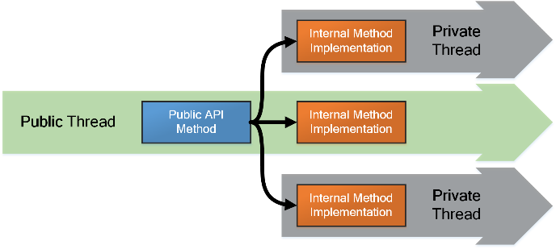  
 
##Tasks and the Task Asynchronous Pattern

Methods within the ArcGIS Pro SDK fall into three categories:

* Asynchronous methods that can be called on any thread.  Methods of this type are named using an **Async** suffix and usually return Tasks. In some cases, both a synchronous and an asynchronous version of a method may be provided.  

* Synchronous methods that should be called on the worker thread only.  Methods of this type are annotated within the API reference, and a code tip will appear when hovering over the method.  

* Synchronous methods that should be called on the GUI thread only.  These types of methods are usually associated with WPF.  

If a method on a particular object is called on the wrong thread, the call will generate an **_ArcGIS.Core.CalledOnWrongThreadException_** exception.  If unsure about a particular case, you can refer to the SDK component help or Microsoft provided help to determine whether a particular method or property has a restriction.  

Within the SDK—particularly within the ArcGIS.Core namespace—worker thread bound methods and properties tend to be very fine grained.  To reduce the overhead associated with scheduling and thread context switches, these methods are synchronous and must be coded using Tasks.   

Microsoft’s .NET Task Parallel Library **_TPL_** and the associated programming pattern known as the Task Asynchronous Pattern **_TAP,_** simplify the authoring of asynchronous code within a multithreaded application.  The Task class is used to represent an operation executed asynchronously.  

In the example below, the PrintReportAsync method is invoked and immediately returns a Task object to the caller.  Meanwhile, the printing function continues to run in the background on another thread.  

```C#
    private void Button_Click(object sender, RoutedEventArgs e)
    {
      Task t = PrintReportAsync("HP1");
      // Wait until the task is done.
      t.Wait();
      MessageBox.Show("Printed report is ready!");
    }
```

The author of the example wants to show a message when the printing is complete and uses the Wait method on the returned Task object to suspend the calling thread until the task is done.  This approach has two major problems: Since the calling thread cannot do anything else while it is waiting, it’s actually less efficient than simply calling a synchronous version of the print function.  Secondly, since the calling thread is a GUI thread in this case, the user interface will freeze.  A suspended thread obviously cannot process user input, render graphical elements, or do anything at all for that matter.  For these reasons, you should never use the Wait method on a GUI thread.  

Luckily, .NET introduced the language features **_async_** and **_await_**.  The **async** modifier marks the method so that the compiler knows that the method is asynchronous and will be using the await operator.  The **await** operator is where the magic comes in, as this is used to call methods asynchronously and afterward, force the calling thread to automatically return to the next line and continue execution once the asynchronous operation has completed.  The calling the thread—normally the GUI thread—is not blocked and is free to take other actions while the Task on the worker thread is still running.  

Note that the author now accomplishes her original goal with very little change, but doesn’t hang the user interface.   

```C#
    private async void Button_Click(object sender, RoutedEventArgs e)
    {
      Task t = PrintReportAsync("HP1");
      // Wait (without blocking) until the task is done.
      await t;
      // Return here when task is done.
      MessageBox.Show("Printed report is ready!");
    }
```

##Using Run

When an asynchronous function is unavailable, you can easily write your own wrapper functions that internally execute one or more synchronous methods.  The following sample uses the static Run method to queue the execution of the function WorkFunc to a random thread in the Task thread pool.  Note that the click method immediately returns to the caller while the WorkFunc continues to execute on the worker thread.  

```C#
    private void Button_Click(object sender, RoutedEventArgs e)
    {
      Task t = Task.Run((Action)WorkFunc);
    }
    private void WorkFunc()
    {
      // Do Work
    }
```

Instead of using a separate function, an *anonymous* function—called a Lambda—can be employed.  Using lambdas keeps the worker code within the same function and lets you use arguments and local variables within the lambda as if they were part of the containing function.   

```C#
    private void Button_Click(object sender, RoutedEventArgs e)
    {
      int steps = GetSteps();
      Task t = Task.Run(() =>
      {
        // I can use the variable “steps” here even though I'm in a
        // different function running on a different thread!
        // Do work
      });
    }
```
Tasks can also be parameterized to return a particular type, as the result of whatever the lambda computes:  

```C#
      Task<double> t = Task.Run<double>(()=>
      {
        double result;        
        // Compute floating point result here...
        return result;
      });
```
The **await** operator can also be used in-line to obtain the result of the asynchronous function, and without having to extract it from the returned Task:  

```C#
    private async void Button_Click(object sender, RoutedEventArgs e)
    {
      double computedValue = await Task.Run<double>(()=>
      {
        double result = 42.0;        
        // Compute floating point result here...
        return result;
      });
      // Execution automatically resumes here when the Task above completes!
      MessageBox.Show(String.Format("Result was {0}",  computedValue.ToString()));
    }
```
Note that there is a small overhead associated with **await**, so it’s always more efficient to call multiple synchronous methods within your own lambda than to call many asynchronous functions using await; this is particularly true when coding loops where the cost of using await through hundreds or thousands of iterations will become substantial.  

##Using QueuedTask   

While Tasks are a regular fixture within any Add-In code, Tasks need to be *dispatched* in Pro differently from traditional TAP.  The framework provides a custom Task scheduler that should be used when dispatching Tasks that make calls to synchronous methods within the ArcGIS Pro SDK.  Rather than calling Task.Run however, Add-In developers should call QueuedTask.Run instead:  

```C#
      Task t = QueuedTask.Run(()=>
      {
        // Call synchronous SDK methods here
      });
```
The QueuedTask class is used instead of the Task class for several reasons: 

**Queuing and concurrency control**

When Tasks are dispatched using Task.Run, the associated Task will execute on a random thread in the managed thread pool each time it’s called.  If a subsequent call to Task.Run is called from anywhere else in the application, the new Task will start running immediately on yet another thread—potentially while the first Task is still running on the first thread.  Going back to the list of challenges inherent in multithreaded code, it should be obvious that executing unorganized operations concurrently is likely to lead to crashes and corruption of application state.  The queuing behavior of QueuedTask.Run ensures the proper ordering of calls and reduces the risk of conflicts.  Remember that the parallelism going on within ArcGIS Pro is accomplished internally; this simplifies the public programming model and greatly reduces the likelihood of conflicts.  

**Affinity and state**

For performance reasons, ArcGIS Pro maintains considerable state on specific threads and in many cases, uses objects that have thread affinity.  Thread affinity simply means that an object is tied to a particular thread and should not be interacted with from any thread but the thread it has affinity with.  Affinity constraints are common in operating systems and components, including database connections, Windows, Controls, input queues, timers, and COM servers.  In WPF for example, calling methods on any object derived from WPF’s DependencyObject class will result in an exception if the call is made from a thread the object wasn’t created on.   

Threads in the managed thread pool are also incompatible with most COM components, so you should not attempt to use Task.Run with code that might execute COM components directly or indirectly.   

**Application Integration**

When Tasks are dispatched using QuededTask.Run, they are automatically integrated with various features within the application:


1. The extended Progress/Cancelation framework where progress, including the programmable progress dialog, is displayed and hidden automatically and where cancellation state is properly communicated between relevant parts of the application.  

2. The application busy state system where UI elements such as buttons and tools are automatically enabled and disabled when Tasks are running.  Task execution can also be coordinated with critical phases such as view creation and application shutdown.

3. Queued Tasks are enlisted in the framework’s diagnostic facilities, when enabled.  This lets developers monitor the sequence of running Tasks, the functions Tasks are executing, and the duration of execution.  This kind of information is invaluable in debugging and performance analysis.

**Acceptable cases for using Task.Run**

There are cases where the use of Task.Run is ok, such as when executing independent background operations consisting entirely of managed code—so long as the particular managed components in use do not have thread affinity.  The developer takes full responsibility for handling cancellation, displaying progress, enabling/disabling the UI appropriately, coordinating operations, and handling logical conflicts.   

##Progress and Cancelation
Asynchronous methods may sometimes accept a Progressor argument, an object which is used by the caller to configure the progress dialog and cancellation settings, and to coordinate communication between the caller and callee.  Asynchronous methods which are not cancelable take a Progressor class while cancelable methods take a CancelableProgressor class.  

Progressor objects follow the pattern established by Microsoft’s CancelationToken, and cannot be created directly; instead, the developer must create a ProgressorSource or CancelableProgressorSource.  

The “source” objects let you configure how the progressor will handle progress without exposing these settings to external code which might access the progressor.  The ProgressorSource object exposes the following constructors: 

```C#
  public ProgressorSource(Action<Progressor> callback)
  public ProgressorSource(ProgressDialog progDlg) 
  public ProgressorSource(string message, bool delayedShow = false)
```

The first override takes a delegate which will be called at regular intervals while the task is running.  This option is appropriate when you want to provide specialized feedback during task execution.  

The second override takes a separately constructed progress dialog object.  If not already shown, the progressor will automatically show this progress dialog when the task starts executing and automatically hide it when the task completes.  If the dialog is already visible, the progressor will simply update the contents of the dialog while running, and it will be the developer’s duty to hide the progress dialog when appropriate.  This option is appropriate when you want to manually control progress dialog visibility, such as when you need to keep the progress dialog up across several separate tasks.  

The third override will automatically create and show a progress dialog when the task starts executing and hide it when the task completes.  The delayedShow parameter controls whether the progress dialog should show immediately or delay its appearance to allow quick tasks to complete and avoid appearing at all if unnecessary.  If the task is expected to execute quickly, set this parameter to true.  If you expect the task to take more than a second or two to complete, set delayedShow to false so that the progress dialog appears immediately to convey a more responsive feel.  

CancelableProgressors require an additional argument which specifies what the cancel message should say.  The cancel message will appear as soon as the user clicks the cancel button on the dialog.  

```C#
  public CancelableProgressorSource(Action<CancelableProgressor> callback)
  public CancelableProgressorSource(ProgressDialog progDlg)
  public CancelableProgressorSource(string message, string cancelMessage, bool delayedShow = false)
```

##Example method implementation using cancelation  

The specialized CancelableProgressor exposes a CancellationToken property which can be used to communicate cancellation.  Within the method’s implementation, code running in loops should simply check the IsCancellationRequested property and exit the method by throwing an OperationCanceledException (which acknowledges the request for cancellation) as demonstrated below:    

```C#
public Task<long> CalcFactorialAsync(int x, CancelableProgressor progressor)
{
  return QueuedTask.Run<long>(() =>
  {
    long result = 1;

    for (int i = 1; i < x; ++i)
    {
      if (progressor.CancellationToken.IsCancellationRequested)
        throw new OperationCanceledException();

      result *= i;
    }

    return result;
  });
}
```

##Using the integrated progress dialog within Asynchronous Methods  

If the Progressor has been configured to show progress, the running task can update what information is displayed on the progress dialog using the progressor (both Progressor and CancelableProgressor support progress dialogs):  

```C#
public Task<long> CalcFactorialAsync(int x, Progressor progressor)
{
  return QueuedTask.Run<long>(() =>
  {
    long result = 1;

    for (int i = 1; i < x; ++i)
    {
      progressor.Message = string.Format("Working on step:{0}", i);

      result *= i;
    }

    return result;
  }, progressor);
}
```
 
##Common complications

**Constant state assumptions**

Consider the following example authored by an Add-In developer.  This call is invoked from the GUI thread, and the intent here is to delete the specified layer from the active view’s map.  

```C#
private Task DeleteSelectedLayerAsync(Layer layer)
{
  return QueuedTask.Run(() =>
  {
      MapView.Active.Map.RemoveLayer(layer);
  });
}
```

Though straightforward in appearance, this function will occasionally result in an exception when put into use within the application.  The mistake here was to assume that the state of the system remains static across threads.  Previously queued operations may be running, and these need to complete before another operation can start executing.  During that time, the state of the application may change due to user interaction or the result of operations still running.  In this case, the active view may have become a table before the lambda actually starts executing, in which case, the map will be null resulting in an exception.  The safe approach is to avoid “chaining” calls on member variables or variables passed between threads; use local variables as a snapshot of the application state when the method was called since they won’t change out from under you.  

```C#
private Task DeleteSelectedLayerAsync(Layer layer)
{
  // Take a “snapshot” of the map on the active view.
  Map m = MapView.Active.Map;
  return QueuedTask.Run(() =>
  {
      m.RemoveLayer(layer);
  });
}

Programmers in a multithreaded environment should also code defensively.  Consider a Task that alters how a particular layer is symbolized.  If such a Task ends up queued *behind* another Task which happens to remove this same layer from the map, the second operation is logically invalidated by the first!  To handle this properly, the second Task should be coded to display a warning, or simply abort the operation silently when it learns that the layer was deleted.  


**Thread Safe Data Binding with WPF**

By default, WPF data bound collections must be modified on the thread where the bound WPF control was created.  This limitation becomes a problem when you want to fill the collection from a worker thread to produce a nice experience: for example, a search result list should be gradually filled as more matches are found, without forcing the user to wait until the whole search is complete.  

To get around this limitation, WPF provides a static BindingOperations class that lets you establish an association between a lock and a collection (e.g. ObservableCollection<T>).  This association allows bound collections to be updated from threads outside the main GUI thread, in a coordinated manner without generating the usual exception.  

```C#
BindingOperations.EnableCollectionSynchronization(Items, _lockObj); 
```

In the example above, the _lockObj member variable—of type Object—is typically instantiated when the containing class is created and will serve as the coordinating lock.  Once EnableCollectionSynchronization is called, WPF will enter the specified lock whenever reading from or writing to the bound collection.  Note that as the owner of the collection, you are likewise obligated to enter the lock when reading from or writing to the collection.    

ReadOnlyObservableCollection wrappers are commonly used to enforce read only semantics on observable collection properties.  To properly setup the multithreaded synchronization, you’ll need to call EnableCollectionSynchronization on the wrapper instead of the collection itself, since it’s the wrapper that WPF will actually be binding to.   

```C#
internal class HelloWorld
{
  private ObservableCollection<string> _items = new ObservableCollection<string>();
  private ReadOnlyObservableCollection<string> _itemsRO;
  private Object _lockObj = new Object();
  internal HelloWorld()
  {
    _itemsRO = new ReadOnlyObservableCollection<string>(_items);
    BindingOperations.EnableCollectionSynchronization(_itemsRO, _lockObj);
  }
// The public property used for binding 
public ReadOnlyObservableCollection<string> Items { get { return _itemsRO; } }
Within the worker function below, the lock is entered before altering the collection:

public void FillCollectionAsync()
{
  QueuedTask.Run(() =>
  {
    // Reads and Writes should be made from within the lock
    lock (_lockObj)
    {
       _items.Add( GetData() );
    }
  });
}
```

**“Live” objects as properties**

Care should be taken when exposing objects—especially collections—as public properties if the collection is likely to change on a separate thread.  If someone gets and holds such a property and later starts enumerating through it thread A, an exception may be generated if your own code modifies the collection on thread B since there is no lock to collaborate with.  Handing out read only “snapshots” of the collection is safer.  

**Invoking code on the GUI thread**

There are occasionally instances where while your code is running along on a worker thread, you encounter a situation where you need to ask for input from the user before proceeding.  You should not try to present a dialog directly from the worker thread as Windows have thread affinity.  A Window or dialog created on the worker thread will not connect to the GUI thread’s input queue and will not honor the z-order and focus policy set by the GUI thread.  In general, you can execute code on the GUI thread from a worker thread using the application’s dispatcher object.   

This can be done synchronously:

```C#

      FrameworkApplication.Current.Dispatcher.Invoke(()=>
      {
        // Do something on the GUI thread
        System.Windows.MessageBox.Show("Ready!");
      });
```
Or asynchronously:
```
      FrameworkApplication.Current.Dispatcher.BeginInvoke(()=>
      {
        // Do something on the GUI thread
        System.Windows.MessageBox.Show("Ready!");
      });
```

Developers should try to collect needed information from the user on the GUI thread before executing work so that you don’t have to use this trick.  Blocking calls made between threads risk deadlocks and hold up operations running on the worker thread.   

**Asynchronous Exception Handling**

Like synchronous functions, asynchronous functions can throw exceptions.  This introduces an interesting problem since the caller provides the try/catch on one thread, and the exception is thrown on another.  In addition, the calling frame isn’t usually still on the stack when the exception is thrown.   

.NET once again comes to the rescue and lets you use async/await with try/catch such that if an exception is thrown by the code executing within the Task, you’ll be able to catch back where the asynchronous function was called.  Note that the asynchronous function must return Task or Task<T> for asynchronous exceptions to be properly conveyed (not void).   

```C#
      try
      {
        var result = await PrintMapAsync();
      }
      catch (Exception e)
      {
        // handle exception.
      }
```

If an exception is thrown from the worker and you didn’t provide a try/catch around where you awaited the call, the .NET runtime will plug the exception—as an inner exception—into a UnobservedException.

Unobserved exceptions usually show up only when the exception object is collected by .NET’s garbage collection thread, nowhere near where the exception actually occurred.  If you get one of these, examine the inner exception within to obtain the faulting call stack.  In VisualStudio’s watch window, you can use the $exception pseudo variable to examine the current exception object.  

##Further Reading

[Task Asynchronous Pattern - MSDN](https://msdn.microsoft.com/en-us/library/hh873175%28v=vs.110%29.aspx "Task Asynchronous Pattern - MSDN")

[Best practices in Asynchronous Programming – Stephen Cleary](https://msdn.microsoft.com/en-us/magazine/jj991977.aspx "Best practices in Asynchronous Programming – Stephen Cleary")


